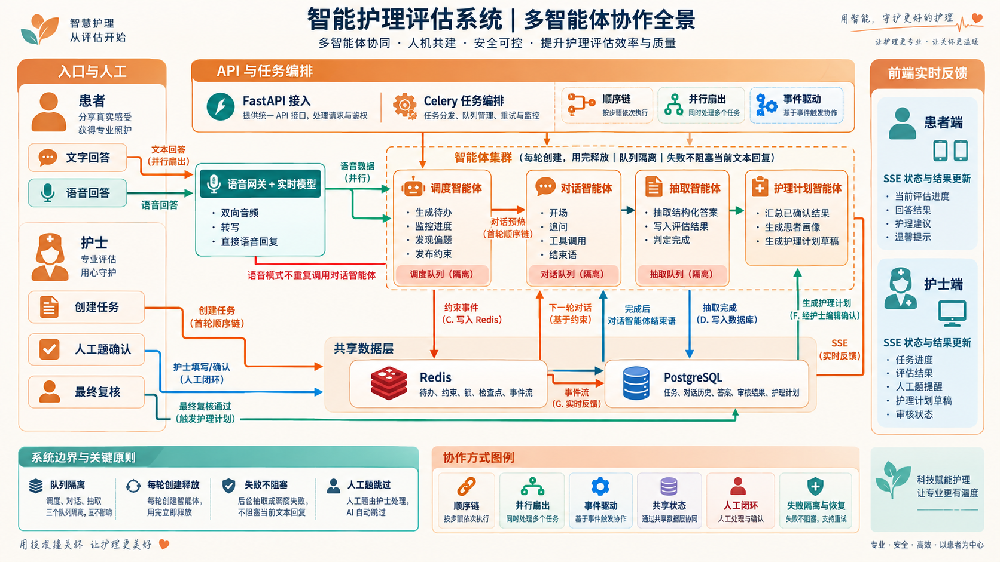

# 智能护理评估系统：多智能体协作方式

## 1. 参与者与职责

| 参与者 | 主要职责 | 主要输出 |
| --- | --- | --- |
| 调度智能体（Schedule Agent） | 根据患者、量表和历史生成待办题目；监控进度与偏题；给下一轮对话发布约束 | Task-todo、进度、引导建议、约束事件 |
| 对话智能体（Dialog Agent） | 生成开场、追问和结束语；读取待办、历史及最新约束；执行必要工具调用 | 患者可见的文本回复、对话事件 |
| 抽取智能体（Extraction Agent） | 从患者回答和上下文中抽取结构化答案；写入评估结果；判断量表是否完成 | 结构化答案、字段进度、完成状态 |
| 护理计划智能体（Nursing Plan Agent） | 汇总已确认的评估结果和患者资料，生成患者画像及护理计划草稿 | 患者画像、护理问题、护理计划草稿 |
| 语音网关与实时模型 | 处理双向音频、语音转写和实时语音回复；把转写结果交给后台智能体 | 转写文本、实时语音回复、语音状态事件 |
| 护士 | 处理需人工题、复核 AI 结果、确认最终评估、编辑护理计划 | 人工答案、审核结论、最终护理计划 |

语音网关属于实时交互执行层，不是与四个业务智能体并列的业务智能体。护士属于人工决策层，是系统协作闭环的一部分。

## 2. 六种协作方式

### 2.1 顺序链

创建新评估任务时，系统按固定顺序执行：

`护士创建任务 → 调度智能体准备待办 → 对话模型预热 → 对话智能体生成开场`

后一步依赖前一步的结果，因此首轮采用顺序链，确保开场前已经具备题目计划和模型准备状态。

### 2.2 并行扇出

患者提交一条文字回答后，系统将同一轮输入同时交给三个后台任务：

- 对话智能体立即生成下一轮回复；
- 调度智能体观察进度和语义偏离；
- 抽取智能体提取并保存结构化答案。

对话智能体只读取此前已完成的后台结果，不等待本轮调度和抽取完成。这样可以缩短患者等待时间；调度或抽取暂时失败也不会阻塞当前文本回复。

### 2.3 事件驱动

智能体之间不直接互相调用内部实现，而是通过事件和任务传递协作结果：

- 调度智能体把约束事件写入 Redis；
- 对话智能体在下一轮消费最新约束；
- 各任务把状态与结果写入 Redis Stream；
- SSE 将事件推送到患者端和护士端；
- 抽取完成后，文字模式触发对话智能体生成结束语。

### 2.4 共享状态

系统用两类存储承担不同职责：

- **Redis**：待办、约束、锁、检查点、预热标记和实时事件流；
- **PostgreSQL**：患者与任务、对话历史、结构化答案、人工审核结果和护理计划。

智能体通过共享状态协作，但不共享长期运行的智能体实例。每轮任务创建所需智能体，执行结束后释放。

### 2.5 人工闭环

标记为 `manual_required` 的题目不会交给 AI 作答：

`需人工题 → 患者端显示“等待人工” → 护士填写或确认 → 结果写入 PostgreSQL`

人工题不计入患者需完成的 AI 题目进度。护士还负责复核 AI 抽取结果，并在最终确认后允许生成护理计划。

### 2.6 失败隔离与恢复

- 调度、对话、抽取使用相互隔离的任务队列；
- 单个后台任务失败不会直接拖垮其他智能体；
- 文字模式下，调度或抽取失败不阻塞当前对话回复；
- Redis 中的锁、检查点和事件状态用于防重、恢复和继续处理；
- 语音链路异常时可以切换到文字输入，已落库的历史和评估结果继续保留。

## 3. 文字模式完整链路

1. 护士创建任务，调度智能体生成初始待办。
2. 对话模型预热，对话智能体生成开场问题。
3. 患者提交文字回答，API 保存患者消息。
4. 对话、调度、抽取三个任务并行执行。
5. 对话智能体生成下一问；调度智能体发布供下一轮使用的约束；抽取智能体更新结构化答案和进度。
6. 抽取智能体判断评估完成后，触发对话智能体生成结束语。
7. 护士复核结果，处理人工题并确认最终评估。
8. 护理计划智能体读取已确认数据，生成草稿供护士编辑确认。

## 4. 语音模式完整链路

1. 患者音频通过 WebSocket 进入语音网关和实时模型。
2. 实时模型完成语音转写，并直接生成语音回复。
3. 转写文本保存后，并行交给调度智能体和抽取智能体。
4. 语音模式不再调用对话智能体生成同一轮回复，避免重复提问或重复播报。
5. 调度和抽取结果继续写入 Redis 与 PostgreSQL，并通过 SSE 更新前端。
6. 语音异常时，患者可以切换到文字继续评估。

## 5. 协作边界

- 调度智能体决定“接下来应处理什么”，不直接替患者填写答案。
- 对话智能体决定“如何与患者交流”，不负责最终审核。
- 抽取智能体负责“从回答中得到结构化结果”，不直接控制对话节奏。
- 护理计划智能体只使用已经确认的评估数据生成草稿。
- 护士保留人工题、最终评估和护理计划的确认权。
