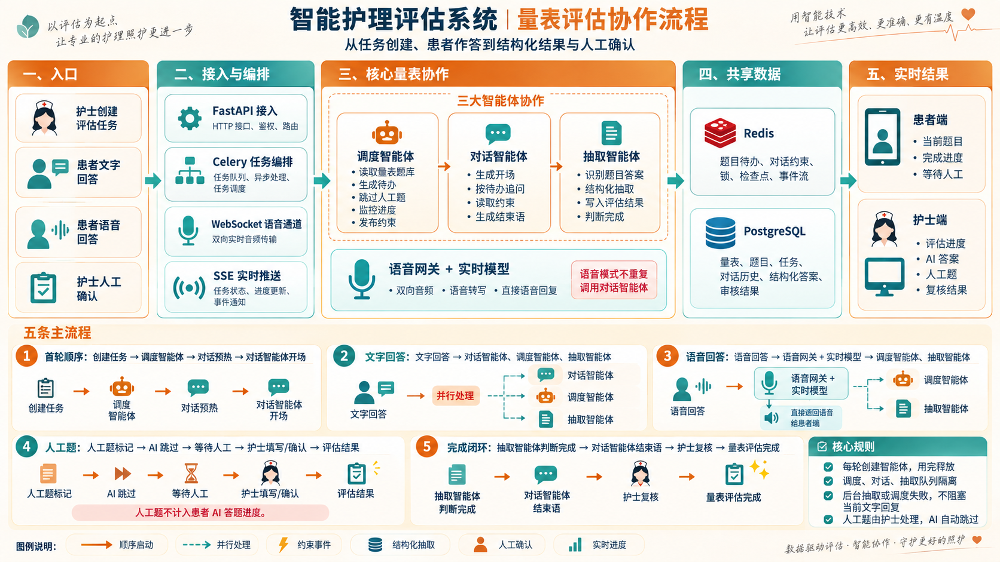

# 量表评估多智能体协作流程说明



## 1. 文档目的

本文说明量表评估过程中各参与方、智能体、数据存储和前端之间的协作关系。范围从护士创建评估任务开始，到患者完成作答、系统抽取结构化答案、护士复核并确认量表结果为止。

本文仅描述量表评估，不包含护理计划、护理措施、护理宣教和患者画像生成流程。

## 2. 图中五个区域

### 2.1 入口

量表评估包含四类业务入口：

- **护士创建评估任务**：选择患者和需要评估的量表，形成一次独立的评估任务。
- **患者文字回答**：患者通过文字提交当前问题的答案。
- **患者语音回答**：患者通过麦克风提交音频，由实时语音链路处理。
- **护士人工确认**：护士处理人工题，并复核 AI 抽取的评估结果。

### 2.2 接入与编排

- **FastAPI 接入**：提供登录、任务、量表、对话、字段抽取和审核等接口，并完成身份校验与请求路由。
- **Celery 任务编排**：将调度、对话和抽取任务发送到对应队列，负责异步执行、任务隔离和必要的重试。
- **WebSocket 语音通道**：在患者端与语音网关之间传输双向实时音频和语音状态。
- **SSE 实时推送**：把评估进度、抽取结果、人工题状态和完成事件推送到患者端与护士端。

### 2.3 核心量表协作

#### 调度智能体

调度智能体负责决定“接下来处理哪些题”：

- 读取本次任务包含的量表和题目；
- 生成患者需要完成的题目待办；
- 跳过标记为 `manual_required` 的人工题；
- 观察评估进度和患者回答是否偏离当前问题；
- 将下一轮对话需要遵守的约束发布到 Redis。

#### 对话智能体

对话智能体负责决定“如何向患者提问和回应”：

- 根据题目待办生成开场问题；
- 结合对话历史进行追问；
- 在下一轮读取调度智能体发布的约束；
- 在所有患者题完成后生成结束语。

对话智能体不负责最终确认结构化答案，也不处理人工题。

#### 抽取智能体

抽取智能体负责将自然语言回答转换为量表数据：

- 识别患者回答对应的量表题目；
- 提取答案、选项、分值或其他结构化字段；
- 将抽取结果写入评估记录；
- 计算已完成字段和剩余字段；
- 判断患者可回答的题目是否全部完成。

#### 语音网关与实时模型

语音网关承担实时交互执行，不作为第四个业务智能体：

- 接收患者的实时音频；
- 将音频发送给实时模型；
- 获取语音转写；
- 直接生成并播放语音回复；
- 将转写文本交给调度智能体和抽取智能体继续处理。

语音模式不会再次调用对话智能体生成同一轮回答，以免发生重复提问或重复播报。

### 2.4 共享数据

#### Redis

Redis 保存短期协作状态：

- 当前题目待办；
- 对话约束事件；
- 任务锁与防重状态；
- 执行检查点；
- SSE 使用的实时事件流。

#### PostgreSQL

PostgreSQL 保存需要长期保留的业务数据：

- 量表和题目定义；
- 患者评估任务；
- 对话历史；
- AI 抽取的结构化答案；
- 护士填写的人工答案；
- 最终审核结果。

### 2.5 实时结果

患者端主要展示：

- 当前需要回答的问题；
- 已完成题目和整体进度；
- 需要护士处理的“等待人工”状态；
- 评估是否已经完成。

护士端主要展示：

- 患者的实时评估进度；
- AI 已抽取的答案；
- 等待处理的人工题；
- 最终复核状态。

## 3. 五条主要流程

### 3.1 首轮启动流程

```text
护士创建任务
  → 调度智能体生成题目待办
  → 对话模型预热
  → 对话智能体生成开场问题
```

首轮采用顺序执行。对话智能体需要先获得调度结果，才能围绕本次任务中的量表正确开场。

### 3.2 文字回答流程

```text
患者提交文字回答
  ├─→ 对话智能体：生成当前回复或下一问
  ├─→ 调度智能体：观察进度并发布下一轮约束
  └─→ 抽取智能体：提取并保存结构化答案
```

三个任务采用并行扇出。对话智能体不等待本轮调度和抽取完成，因此后台抽取或调度暂时失败时，当前文字回复仍可继续生成。

调度智能体本轮产生的约束主要供下一轮对话使用，而不是中途修改已经开始生成的回复。

### 3.3 语音回答流程

```text
患者提交语音
  → 语音网关与实时模型
  ├─→ 直接向患者返回语音回复
  ├─→ 调度智能体观察转写内容
  └─→ 抽取智能体从转写内容提取答案
```

实时模型已经承担本轮对话回复，因此后台只运行调度和抽取任务，不再运行对话智能体。

### 3.4 人工题流程

```text
题目标记 manual_required
  → 调度智能体和对话智能体跳过
  → 患者端显示“等待人工”
  → 护士填写或确认
  → 答案写入评估结果
```

人工题不计入患者需要完成的 AI 题目进度。患者完成所有可由 AI 处理的题目后，可以结束患者侧作答，但整个任务仍可能等待护士补全人工题。

### 3.5 完成与复核流程

```text
抽取智能体判断患者题已完成
  → 对话智能体生成结束语
  → 护士检查 AI 答案和人工题
  → 护士确认量表结果
  → 量表评估完成
```

系统中的“患者完成作答”和“量表最终完成”是两个状态：前者表示患者无需继续回答，后者还要求人工题与护士复核均已完成。

## 4. 智能体之间的协作方式

| 协作方式 | 使用场景 | 作用 |
| --- | --- | --- |
| 顺序启动 | 创建任务后的首轮开场 | 保证先有题目计划，再开始对话 |
| 并行处理 | 患者提交文字或语音转写后 | 同时完成回复、进度观察和答案抽取 |
| 约束事件 | 调度智能体影响下一轮对话 | 降低智能体之间的直接依赖 |
| 结构化抽取 | 自然语言回答转为量表字段 | 形成可计算、可审核的评估结果 |
| 人工确认 | 人工题和最终审核 | 保留护士的专业判断权 |
| 实时进度 | Redis Stream 与 SSE | 让患者端和护士端同步看到状态变化 |

## 5. 关键边界与容错规则

1. 调度、对话和抽取任务分别进入隔离队列，单个队列故障不会直接阻塞所有流程。
2. 智能体按每轮任务创建，执行结束后释放，不长期持有会话实例。
3. 文字模式下，后台调度或抽取失败不应阻塞当前回复。
4. 语音模式由实时模型直接回复，不重复启动对话智能体。
5. 人工题由护士处理，AI 只负责跳过并维护等待状态。
6. PostgreSQL 中的任务、历史和答案是长期业务记录；Redis 主要保存短期协作状态和实时事件。
7. 语音链路异常时可以切换文字输入，已经保存的对话与评估结果继续有效。

## 6. 图例说明

- **顺序启动**：前一步完成后才执行下一步。
- **并行处理**：同一输入同时发送给多个智能体。
- **约束事件**：调度结果通过事件影响下一轮对话。
- **结构化抽取**：把患者自然语言转为量表字段和值。
- **人工确认**：由护士填写、修正或最终确认结果。
- **实时进度**：通过事件流持续更新患者端和护士端。
