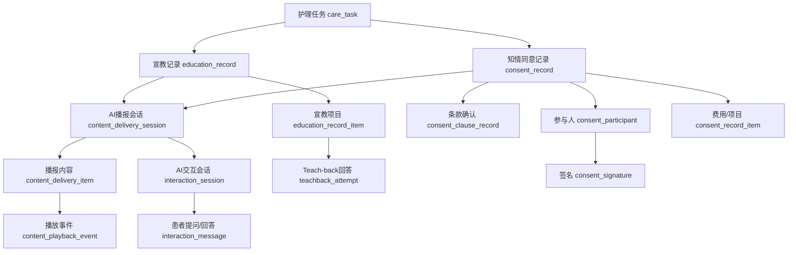

# 出入院宣教与知情同意数据库设计补充

> 文档状态：业务讨论稿  
> 来源材料：`docs/文档/出入院宣教（冠心病患者为例）`、`docs/文档/知情同意书`  
> 本文补充 `数据库表业务设计.md` 中的宣教、Teach-back、知情同意和AI语音播报设计。

## 1. 业务理解

出入院宣教和知情同意都会使用AI向患者播报内容，但二者的业务目的不同。

| 业务 | 主要目的 | 核心结果 |
| --- | --- | --- |
| 入院宣教 | 介绍病区环境、住院制度、呼叫铃、订餐、探视、消防和检查流程 | 哪些内容已宣教，患者是否有疑问 |
| 出院宣教 | 根据病种、手术、药物和风险提供个体化康复指导 | 哪些内容适用于患者，是否理解，复诊和随访如何安排 |
| 医学常识宣教 | 对药物、VTE、检查禁忌等重要知识进行解释 | Teach-back是否通过，是否需要护士再次宣教 |
| 知情同意 | 向患者宣讲权利义务、风险、费用和检测内容 | 播报了哪个法律版本、患者是否理解和同意、由谁签署 |

不能只保存“材料ID + 已完成”。系统至少需要知道：

1. 当时使用的是哪个版本。
2. 系统计划向患者播报哪些内容。
3. 实际播报了哪些段落。
4. 实际播报的文本、语音和时长。
5. 患者是否暂停、跳过、重听或提出问题。
6. 哪些内容需要Teach-back，患者回答是否通过。
7. 知情同意的每个关键条款是否被明确确认。
8. 患者本人、家属、授权代理人、监护人、见证人和医护人员分别如何签署。

## 2. 总体关系

## 3. 设计原则

### 3.1 模板与业务记录分离

宣教材料、知情同意文档和播报文本属于模板；患者某次实际接受的内容属于业务记录。

模板更新时创建新版本，历史记录继续引用旧版本。

### 3.2 原文、患者文本和语音文本分离

同一内容需要保留三种文本：

| 文本 | 用途 |
| --- | --- |
| 原始文本 | 追溯原始文档和法律内容 |
| 患者易懂文本 | 页面展示或AI口语化表达 |
| 语音播报文本 | TTS实际使用的文本，包含停顿和口语表达 |

AI可以调整表达方式，但知情同意的关键含义不得改变。

### 3.3 必须保存实际播报快照

不能只通过模板推断患者听到了什么。每次播报都要保存当时实际播报的文本、音频、顺序和完成情况。

### 3.4 宣教理解与知情同意决定分离

宣教的结果是“已宣教、是否理解”；知情同意的结果是“同意、拒绝、部分同意、需要人工解释”。

### 3.5 AI播报不等同于电子签名

AI可以完成解释、播报和理解确认，但法律意义上的签署方式仍需根据医院制度确定。数据库必须分别保存播报记录、患者决定和签名记录。

## 4. 通用AI播报域

### 4.1 `content_delivery_session` 内容播报会话

业务目的：表示AI向患者或家属播报一次宣教或知情同意内容的完整过程。

核心字段：

| 字段 | 说明 |
| --- | --- |
| `delivery_no` | 播报会话编号 |
| `task_id` | 所属护理任务 |
| `patient_id` | 患者ID |
| `encounter_id` | 住院记录ID |
| `business_type` | 入院宣教、出院宣教、医学宣教、知情同意 |
| `business_id` | `education_record.id`或`consent_record.id` |
| `interaction_session_id` | 关联AI对话会话 |
| `participant_type` | 患者本人、家属、代理人 |
| `delivery_channel` | 文字、AI语音、预录音频、护士人工 |
| `tts_provider` | TTS服务提供方 |
| `tts_model` | TTS模型 |
| `voice_name` | 音色 |
| `language_code` | 普通话、粤语等 |
| `speech_rate` | 语速快照 |
| `delivery_status` | 待开始、播报中、暂停、已完成、中断、转人工 |
| `started_at` | 开始时间 |
| `completed_at` | 完成时间 |
| `planned_duration_ms` | 预计播报时长 |
| `actual_duration_ms` | 实际播报时长 |
| `completion_rate` | 完成比例 |
| `handoff_required` | 是否需要护士接管 |
| `handoff_reason` | 接管原因 |

业务说明：

- 同一宣教或同意记录允许多次播报，例如患者中断后再次继续。
- AI播报和患者对话共用 `interaction_session` 保存患者问题和AI回答。

### 4.2 `content_delivery_item` 播报内容明细

业务目的：保存一次播报会话实际计划和播报的每个内容单元。

核心字段：

| 字段 | 说明 |
| --- | --- |
| `delivery_session_id` | 所属播报会话 |
| `source_type` | 宣教单元或知情同意条款 |
| `source_id` | 对应模板单元ID |
| `sequence_no` | 实际播报顺序 |
| `mandatory` | 是否必须播报 |
| `selected_reason` | 通用必选、疾病匹配、手术匹配、药物匹配、风险触发、护士选择 |
| `original_text_snapshot` | 原始文本快照 |
| `patient_text_snapshot` | 患者易懂文本快照 |
| `spoken_text_snapshot` | 实际播报文本快照 |
| `audio_url` | 本次播报音频地址 |
| `audio_duration_ms` | 音频时长 |
| `delivery_status` | 未开始、播报中、已完成、跳过、中断 |
| `started_at` | 本段开始时间 |
| `completed_at` | 本段完成时间 |
| `listened_duration_ms` | 实际收听时长 |
| `completion_rate` | 本段完成比例 |
| `replay_count` | 重听次数 |
| `patient_acknowledged` | 患者是否确认已听 |

业务说明：

- 知情同意的强制条款不允许由患者直接跳过。
- 播报文本可能与模板语音文本略有不同，因此必须保存快照。

### 4.3 `content_playback_event` 播放操作事件

业务目的：记录患者播放、暂停、继续、跳过、重听和播放完成等行为。

核心字段：

| 字段 | 说明 |
| --- | --- |
| `delivery_session_id` | 播报会话 |
| `delivery_item_id` | 播报内容明细 |
| `event_type` | 开始、暂停、继续、跳过、重听、完成、播放失败 |
| `position_ms` | 发生事件时的播放位置 |
| `event_time` | 事件时间 |
| `event_source` | 患者操作、AI控制、护士操作、系统异常 |
| `device_info` | 设备信息 |
| `failure_reason` | 播放失败原因 |

业务说明：

- 该表用于证明内容是否实际播放，并分析患者中断或反复收听的内容。
- 一期可只记录开始、完成、跳过、重听四类关键事件。

## 5. 出入院宣教模板域

### 5.1 `education_program` 宣教方案主档

业务目的：定义一种完整宣教方案。

示例：

- 心内科入院宣教
- 冠心病患者出院宣教
- PCI术后出院宣教
- VTE护理宣教
- 心内科药物宣教

核心字段：

| 字段 | 说明 |
| --- | --- |
| `program_code` | 宣教方案编码 |
| `program_name` | 宣教方案名称 |
| `education_stage` | 入院、住院中、出院 |
| `program_type` | 常规流程、护理安全、医学常识、疾病专项、药物专项 |
| `applicable_department` | 适用科室 |
| `applicable_disease_tags` | 适用疾病标签 |
| `source_file` | 来源文档 |
| `status` | 草稿、审核中、已发布、停用 |

### 5.2 `education_program_version` 宣教方案版本

业务目的：保存宣教方案的可执行版本。

核心字段：

| 字段 | 说明 |
| --- | --- |
| `program_id` | 宣教方案主档 |
| `version_code` | 版本号 |
| `publish_status` | 发布状态 |
| `effective_time` | 生效时间 |
| `expire_time` | 失效时间 |
| `content_snapshot` | 完整方案快照 |
| `content_hash` | 内容摘要 |

业务说明：

- 出诊时间、联系电话、费用、探视时间等易变化内容必须通过新版本更新。

### 5.3 `education_unit` 宣教内容单元

业务目的：把长篇宣教材料拆成可选择、可播报、可追踪的最小内容单元。

核心字段：

| 字段 | 说明 |
| --- | --- |
| `program_version_id` | 所属方案版本 |
| `parent_unit_id` | 父级主题 |
| `unit_code` | 内容编码 |
| `unit_title` | 内容标题 |
| `unit_type` | 环境介绍、流程说明、药物、饮食、活动、复诊、随访、风险警示 |
| `original_text` | 原文 |
| `patient_text` | 患者易懂文本 |
| `voice_text` | 语音播报文本 |
| `mandatory` | 是否必须宣教 |
| `teachback_required` | 是否需要Teach-back |
| `risk_level` | 一般、重要、高风险 |
| `sort_no` | 默认顺序 |

材料映射示例：

| 来源内容 | 宣教单元 |
| --- | --- |
| 入院宣教中的床头铃、厕所呼叫铃 | 病区呼叫与紧急求助 |
| 入院宣教中的消防通道和充电限制 | 消防安全 |
| 出院宣教中的抗血小板药 | 用药目的、不可停药、出血观察 |
| 出院宣教中的低盐低脂 | 饮食指导 |
| PCI术后1、3、6、12月复诊 | 复诊计划 |
| VTE踝泵运动 | VTE运动指导 |

### 5.4 `education_selection_rule` 宣教内容选择规则

业务目的：根据患者病种、手术、药物、量表风险和护士选择，决定本次需要宣教哪些内容。

核心字段：

| 字段 | 说明 |
| --- | --- |
| `program_version_id` | 所属方案版本 |
| `unit_id` | 宣教单元 |
| `condition_type` | 疾病、手术、药物、评估结果、年龄、科室 |
| `condition_expression` | 匹配条件 |
| `selection_result` | 自动加入、推荐加入、排除 |
| `priority` | 优先级 |

业务示例：

- 患者进行PCI术后，自动加入双抗药不可自行停药和出血观察。
- 患者使用利尿药，加入服药时间、尿量观察和高钾饮食指导。
- 患者存在跌倒风险，加入防跌倒宣教并进行Teach-back。

## 6. 出入院宣教运行域

### 6.1 `education_record` 患者宣教主记录

业务目的：表示某患者在某次住院中接受某个宣教方案的一次业务记录。

核心字段：

| 字段 | 说明 |
| --- | --- |
| `record_no` | 宣教记录编号 |
| `task_id` | 护理任务 |
| `patient_id` | 患者ID |
| `encounter_id` | 住院记录 |
| `program_id` | 宣教方案 |
| `program_version_id` | 宣教版本 |
| `education_stage` | 入院、住院中、出院 |
| `participant_type` | 患者本人或家属 |
| `record_status` | 待宣教、进行中、待Teach-back、待护士确认、已完成、已中断 |
| `selection_snapshot` | 本次个体化选择条件快照 |
| `started_at` | 开始时间 |
| `completed_at` | 完成时间 |
| `overall_understanding` | 未确认、已理解、部分理解、未理解 |
| `need_nurse_follow_up` | 是否需要护士补充宣教 |
| `nurse_confirmed_by` | 确认护士 |
| `nurse_confirmed_at` | 护士确认时间 |

### 6.2 `education_record_item` 患者宣教项目

业务目的：保存本次宣教实际选择的每个宣教单元及其完成结果。

核心字段：

| 字段 | 说明 |
| --- | --- |
| `education_record_id` | 宣教主记录 |
| `education_unit_id` | 宣教单元 |
| `delivery_item_id` | 实际播报明细 |
| `selection_source` | 自动规则、AI推荐、护士选择 |
| `selection_reason` | 选择原因 |
| `required` | 本次是否必须完成 |
| `education_status` | 待宣教、已播报、已跳过、需人工 |
| `patient_acknowledged` | 是否确认已听 |
| `understanding_status` | 未确认、已理解、未理解 |
| `teachback_required` | 本次是否触发Teach-back |
| `nurse_comment` | 护士补充说明 |

业务说明：

- 出院健康教育纸面上的每个勾选项对应一条宣教项目。
- VTE宣教17项内容逐项保存，不能只存一个“VTE宣教完成”。

### 6.3 `teachback_question` Teach-back问题

业务目的：保存宣教单元对应的理解确认问题。

核心字段：

| 字段 | 说明 |
| --- | --- |
| `education_unit_id` | 所属宣教单元 |
| `question_code` | 问题编码 |
| `question_text` | 反问内容 |
| `standard_answer` | 标准答案 |
| `pass_rule` | 通过规则 |
| `max_attempts` | 最大尝试次数 |

### 6.4 `teachback_attempt` Teach-back回答

业务目的：保存患者每次Teach-back回答和判定结果。

核心字段：

| 字段 | 说明 |
| --- | --- |
| `education_record_item_id` | 对应宣教项目 |
| `question_id` | Teach-back问题 |
| `interaction_message_id` | 患者回答原消息 |
| `attempt_no` | 第几次回答 |
| `patient_answer` | 患者回答快照 |
| `judge_source` | AI或护士 |
| `judge_result` | 通过、未通过、不确定 |
| `judge_reason` | 判定原因 |
| `need_nurse_follow_up` | 是否需护士再次宣教 |

### 6.5 `education_signature` 宣教签名

业务目的：保存VTE、出院健康教育等资料中的护士和患者签名。

核心字段：

| 字段 | 说明 |
| --- | --- |
| `education_record_id` | 宣教记录 |
| `signer_type` | 护士、患者、家属 |
| `signer_id` | 系统用户或患者ID |
| `signer_name_snapshot` | 姓名快照 |
| `signature_method` | 账号确认、手写签名、电子签名、纸质补录 |
| `signature_file_url` | 签名文件 |
| `signed_at` | 签名时间 |

## 7. 个体化用药宣教

### 7.1 `medication_education_knowledge` 药物宣教知识

业务目的：保存药物类别、药物名称、作用、服用注意事项和不良反应等已审核知识。

核心字段：

| 字段 | 说明 |
| --- | --- |
| `drug_code` | 药物或药物类别编码 |
| `generic_name` | 通用名 |
| `brand_name` | 商品名 |
| `drug_category` | 抗凝、抗血小板、降脂、降压、降糖等 |
| `purpose_text` | 药物作用 |
| `administration_text` | 服用方式 |
| `warning_text` | 重点注意事项 |
| `adverse_reaction_text` | 需要观察的不良反应 |
| `emergency_text` | 何时需要就医 |
| `teachback_required` | 是否需要Teach-back |
| `version_code` | 知识版本 |

### 7.2 `patient_medication_education` 患者用药宣教明细

业务目的：保存本次住院实际向患者宣教的药物清单和患者理解情况。

核心字段：

| 字段 | 说明 |
| --- | --- |
| `education_record_id` | 所属宣教记录 |
| `medication_knowledge_id` | 药物宣教知识 |
| `medication_order_id` | 可选，院内医嘱或出院带药ID |
| `drug_name_snapshot` | 当时药名 |
| `dose_snapshot` | 剂量 |
| `frequency_snapshot` | 频次 |
| `route_snapshot` | 用药途径 |
| `duration_snapshot` | 疗程 |
| `warning_snapshot` | 当时宣教的重点警示 |
| `delivery_item_id` | AI播报明细 |
| `understanding_status` | 患者理解状态 |
| `teachback_result` | Teach-back结果 |
| `nurse_confirmed` | 护士是否确认 |

业务说明：

- 药物宣教单上勾选的每一种药物形成一条记录。
- AI应只播报患者实际使用的药物内容。
- 不能仅保存药物类别，因为同类药物可能有不同服用方式和风险。

## 8. 复诊与随访

### 8.1 `follow_up_plan` 出院后计划

业务目的：保存根据疾病、手术和患者情况生成的复诊及随访计划。

核心字段：

| 字段 | 说明 |
| --- | --- |
| `plan_no` | 计划编号 |
| `patient_id` | 患者ID |
| `encounter_id` | 本次住院 |
| `education_record_id` | 来源出院宣教 |
| `plan_status` | 草稿、待确认、已确认、已结束 |
| `confirmed_by` | 确认护士 |
| `confirmed_at` | 确认时间 |

### 8.2 `follow_up_plan_item` 复诊与随访计划项

业务目的：保存具体复诊时间、地点、资料准备和随访渠道。

核心字段：

| 字段 | 说明 |
| --- | --- |
| `follow_up_plan_id` | 所属计划 |
| `item_type` | 门诊复诊、微信随访、电话随访、检查复查 |
| `planned_date` | 计划日期 |
| `time_offset_value` | 出院后1、3、6、12等时间偏移 |
| `time_offset_unit` | 天、周、月 |
| `department_name` | 复诊科室 |
| `location_text` | 复诊地点 |
| `contact_text` | 电话、公众号或其他渠道 |
| `preparation_text` | 需要携带的资料 |
| `status` | 待执行、已完成、已取消、失访 |
| `completed_at` | 完成时间 |

业务说明：

- PCI术后1、3、6、12月复诊应生成4条计划项。
- 出院后第5天或第7天微信随访应生成独立随访计划项。

## 9. 知情同意模板域

### 9.1 `consent_document` 知情同意文档主档

业务目的：定义一种知情同意书或告知书。

示例：

- 住院医疗告知书
- 护理安全知情同意书
- 医保/公医住院身份确认
- 自费项目知情同意书
- 新增医疗服务价格项目知情同意书
- 血液传播性疾病检测告知书

核心字段：

| 字段 | 说明 |
| --- | --- |
| `consent_code` | 文档编码 |
| `consent_name` | 文档名称 |
| `consent_type` | 入院须知、护理安全、费用医保、检查检测 |
| `applicable_scope` | 适用范围 |
| `source_file` | 原始文件 |
| `status` | 状态 |

### 9.2 `consent_document_version` 知情同意文档版本

业务目的：保存具有法律追溯意义的具体文档版本。

核心字段：

| 字段 | 说明 |
| --- | --- |
| `consent_document_id` | 文档主档 |
| `version_code` | 版本号 |
| `effective_time` | 生效时间 |
| `expire_time` | 失效时间 |
| `original_document_url` | 原始文件地址 |
| `document_hash` | 文件摘要 |
| `full_text_snapshot` | 完整文本快照 |
| `publish_status` | 发布状态 |

业务说明：

- 每次知情同意记录必须绑定具体版本并保存文档摘要。
- 文档更新后不能影响已完成的患者同意记录。

### 9.3 `consent_clause` 知情同意条款

业务目的：将长篇文档拆成可播报和确认的条款。

核心字段：

| 字段 | 说明 |
| --- | --- |
| `consent_version_id` | 所属文档版本 |
| `parent_clause_id` | 父条款 |
| `clause_code` | 条款编码 |
| `clause_title` | 条款标题 |
| `clause_type` | 权利义务、风险、费用、隐私、患者声明 |
| `original_content` | 原始条款 |
| `patient_content` | 患者易懂文本 |
| `voice_content` | 语音播报文本 |
| `importance_level` | 一般、重要、关键 |
| `mandatory_delivery` | 是否必须完整播报 |
| `explicit_confirmation_required` | 是否必须明确确认 |
| `teachback_required` | 是否需要理解确认 |
| `sort_no` | 顺序 |

### 9.4 `consent_item_definition` 知情同意项目定义

业务目的：保存费用、自费或护理安全文档中可选择的具体项目。

核心字段：

| 字段 | 说明 |
| --- | --- |
| `consent_version_id` | 所属文档版本 |
| `item_code` | 项目编码 |
| `item_name` | 项目名称 |
| `item_type` | 护理措施、自费项目、价格项目、检测项目 |
| `unit` | 单位 |
| `unit_price` | 单价 |
| `currency` | 币种 |
| `content_text` | 项目说明 |
| `mandatory` | 是否必选 |
| `sort_no` | 顺序 |

业务说明：

- 护理安全知情同意书中的约束、压疮、输液输血、热水袋、防自杀、防走失均为可选项目。
- 新增医疗服务价格项目中的项目编码、名称、单位和单价逐项保存。
- 自费项目文档允许在患者签署时补充实际项目名称。

## 10. 知情同意运行域

### 10.1 `consent_record` 患者知情同意记录

业务目的：表示某患者针对某个知情同意文档版本的一次告知和决定过程。

核心字段：

| 字段 | 说明 |
| --- | --- |
| `record_no` | 同意记录编号 |
| `task_id` | 护理任务 |
| `patient_id` | 患者ID |
| `encounter_id` | 住院记录 |
| `consent_document_id` | 文档主档 |
| `consent_version_id` | 文档版本 |
| `interaction_session_id` | AI对话会话 |
| `primary_participant_id` | 主要决定人 |
| `record_status` | 待告知、播报中、待确认、待签名、已同意、已拒绝、部分同意、需人工解释 |
| `decision_result` | 同意、拒绝、部分同意、未决定 |
| `decision_comment` | 患方意见 |
| `started_at` | 开始时间 |
| `completed_at` | 完成时间 |
| `nurse_confirmed_by` | 确认护士 |
| `nurse_confirmed_at` | 护士确认时间 |

业务说明：

- AI播报完成不代表患者已经同意。
- 患者拒绝或未理解时必须进入护士工作台。

### 10.2 `consent_clause_record` 患者条款确认

业务目的：保存每个关键条款的实际播报和患者确认结果。

核心字段：

| 字段 | 说明 |
| --- | --- |
| `consent_record_id` | 同意记录 |
| `clause_id` | 条款 |
| `delivery_item_id` | 实际播报明细 |
| `delivery_status` | 未播报、已播报、跳过、中断 |
| `patient_reply_message_id` | 患者回答原消息 |
| `understanding_status` | 已理解、未理解、不确定 |
| `confirmation_result` | 确认、拒绝、未决定 |
| `confirmation_comment` | 患者说明 |
| `need_manual_explanation` | 是否需要护士解释 |
| `confirmed_at` | 确认时间 |

### 10.3 `consent_record_item` 患者同意项目

业务目的：保存患者本次实际被告知并同意或拒绝的护理、费用、价格或检测项目。

核心字段：

| 字段 | 说明 |
| --- | --- |
| `consent_record_id` | 同意记录 |
| `item_definition_id` | 项目定义 |
| `item_code_snapshot` | 项目编码快照 |
| `item_name_snapshot` | 项目名称快照 |
| `unit_snapshot` | 单位快照 |
| `unit_price_snapshot` | 单价快照 |
| `quantity` | 数量 |
| `estimated_amount` | 预计金额 |
| `selection_source` | 医嘱、护士选择、患者选择 |
| `decision_result` | 同意、拒绝、未决定 |
| `patient_comment` | 患者意见 |

业务说明：

- 价格和项目内容必须保存签署时快照，不能事后查询当前价格代替。

### 10.4 `consent_participant` 知情同意参与人

业务目的：保存患者本人、家属、监护人、授权代理人、见证人和医护人员的身份及角色。

核心字段：

| 字段 | 说明 |
| --- | --- |
| `consent_record_id` | 同意记录 |
| `participant_role` | 患者、家属、监护人、授权代理人、见证人、护士、医生、院方代表 |
| `person_id` | 系统内人员ID，可为空 |
| `name_snapshot` | 姓名 |
| `relationship_to_patient` | 与患者关系 |
| `identity_type` | 身份证、社保卡、公医证等 |
| `identity_no_ciphertext` | 加密后的证件号 |
| `phone_ciphertext` | 加密后的电话 |
| `address_ciphertext` | 加密后的地址 |
| `civil_capacity_status` | 完全民事行为能力、限制、无民事行为能力 |
| `authorization_required` | 是否需要授权委托 |
| `fingerprint_required` | 是否要求手印 |

业务说明：

- 不应只在签名表中放一个“家属姓名”，因为签署资格和与患者关系会影响同意有效性。

### 10.5 `consent_authorization` 授权委托

业务目的：保存患者授权他人代为签署知情同意时的授权依据。

核心字段：

| 字段 | 说明 |
| --- | --- |
| `consent_record_id` | 同意记录 |
| `authorizer_participant_id` | 授权人 |
| `authorized_participant_id` | 被授权人 |
| `authorization_type` | 书面委托、法定监护、近亲属代签 |
| `authorization_document_url` | 委托书或证明文件 |
| `authorization_scope` | 授权范围 |
| `valid_from` | 生效时间 |
| `valid_to` | 失效时间 |
| `verified_by` | 核验人员 |
| `verified_at` | 核验时间 |

### 10.6 `consent_signature` 知情同意签名

业务目的：保存每个参与人的签名、手印和签署时间。

核心字段：

| 字段 | 说明 |
| --- | --- |
| `consent_record_id` | 同意记录 |
| `participant_id` | 签署参与人 |
| `sign_purpose` | 患者决定、家属确认、医护告知、见证、院方代表 |
| `signature_method` | 账号确认、手写签名、电子签名、纸质补录 |
| `signature_file_url` | 签名文件 |
| `fingerprint_file_url` | 手印文件 |
| `signed_content_hash` | 签署内容摘要 |
| `signed_at` | 签署时间 |
| `signing_ip` | 签署IP |
| `device_info` | 签署设备 |

业务说明：

- `signed_content_hash`应覆盖文档版本、条款确认和项目明细，防止签署后内容被改变。
- 医生、护士、患者、代理人和见证人的签名分别保存。

## 11. 与AI对话记录的关系

| 内容 | 存储位置 |
| --- | --- |
| AI播报的实际文本和音频 | `content_delivery_item` |
| 患者暂停、重听、跳过 | `content_playback_event` |
| 患者提出的问题 | `interaction_message` |
| AI对患者问题的回答 | `interaction_message` |
| 超出知识范围转护士 | `interaction_event`、任务人工介入字段 |
| Teach-back患者回答 | `teachback_attempt`并关联原始消息 |
| 条款确认患者回答 | `consent_clause_record`并关联原始消息 |

AI回答患者问题时，必须基于当前生效版本的宣教内容或知情同意条款。回答中引用的内容单元或条款ID应进入消息元数据，便于审核。

## 12. 材料覆盖映射

### 12.1 出入院宣教材料

| 材料 | 数据库设计 |
| --- | --- |
| 入院宣教录音整理 | 入院宣教方案、环境/流程内容单元、AI播报记录 |
| 办理入院流程 | 入院流程内容单元，可按步骤播报 |
| 出院宣教录音整理 | 出院宣教方案、用药单元、复诊计划、微信随访 |
| PCI术后出院健康教育 | PCI专项宣教、双抗药、饮食活动、复诊和随访 |
| 心内科出院健康教育指引 | 按疾病和药物选择宣教项目 |
| 药物宣教单 | 药物知识库和患者实际用药宣教明细 |

### 12.2 知情同意与护理宣教材料

| 材料 | 数据库设计 |
| --- | --- |
| 住院医疗告知书 | 多条权利义务条款、医护签字、患者/受托人签字 |
| 护理安全知情同意书 | 6类护理安全项目、患者/家属关系、地址、电话、手印和护士签名 |
| 医保/公医身份确认 | 证件号、患者签名/指纹、责任护士和主管医生签名 |
| 自费项目知情同意 | 实际自费项目、患者/代理人、家属/监护人、见证人签名 |
| 新增医疗服务价格项目 | 项目编码、名称、单位、单价和患者决定快照 |
| 血液传播性疾病检测告知 | 检测条款、隐私说明、患者/家属及医护签名 |
| VTE护理宣教 | 17项逐项宣教记录、患者和护士签名 |

## 13. 一期建议落地范围

一期即使暂时不实现完整语音，也应先建立以下表，避免以后迁移历史数据：

| 业务域 | 表 |
| --- | --- |
| 通用播报 | `content_delivery_session`、`content_delivery_item`、`content_playback_event` |
| 宣教模板 | `education_program`、`education_program_version`、`education_unit`、`education_selection_rule` |
| 宣教运行 | `education_record`、`education_record_item`、`teachback_question`、`teachback_attempt`、`education_signature` |
| 用药宣教 | `medication_education_knowledge`、`patient_medication_education` |
| 复诊随访 | `follow_up_plan`、`follow_up_plan_item` |
| 同意模板 | `consent_document`、`consent_document_version`、`consent_clause`、`consent_item_definition` |
| 同意运行 | `consent_record`、`consent_clause_record`、`consent_record_item`、`consent_participant`、`consent_authorization`、`consent_signature` |

## 14. 需要客户和医院确认的问题

| 问题 | 影响 |
| --- | --- |
| AI播报能否替代护士首次口头告知 | 决定AI播报后的护士确认流程 |
| 哪些同意书允许电子签名 | 决定签名方式和法律存证要求 |
| 音频和患者原声保存期限 | 影响对象存储、隐私和成本 |
| 患者是否允许跳过普通宣教内容 | 影响播放控制 |
| 知情同意关键条款是否禁止跳过 | 建议关键条款强制完整播报 |
| Teach-back失败几次转护士 | 建议两次未通过后转人工 |
| 患者无民事行为能力时的签署规则 | 决定参与人与授权校验 |
| 自费和价格项目从哪里同步 | 建议从医院收费或医嘱系统同步并保存签署时快照 |
| 出院复诊和随访是否生成真实待办 | 决定是否与短信、微信或随访系统对接 |
