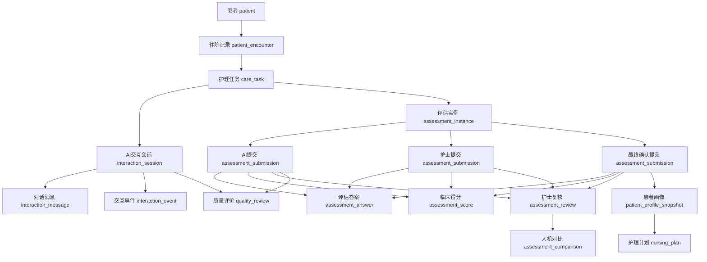

# 医疗评估与宣教系统数据库业务设计

> 文档状态：业务讨论稿  
> 本文只确定业务对象、数据归属和表之间的关系。现有 SQL DDL 暂不视为最终方案，待本文审批后再重新生成。

## 1. 对系统业务的重新理解

系统的核心不是“把纸质量表存进数据库”，而是围绕一次住院过程，完成以下闭环：

1. 护士为患者创建入院评估、知情同意或宣教任务。
2. 患者通过勾选问卷、文字对话或语音对话完成任务。
3. AI按照CICARE流程提问，根据回答进行追问和实时宣教。
4. 系统从患者回答中形成结构化评估答案，并计算量表临床得分。
5. 护士查看完整对话和AI评估结果，进行独立评估、补充问诊和最终确认。
6. 系统保留AI结果、护士结果和最终结果，用于人机对比和科研。
7. 系统根据最终评估生成患者画像和护理计划。
8. 护士还需要分别评价AI对话质量和AI评估质量。

因此，一次业务不能只保存一份“评估答案”。同一个评估必须允许同时存在：

| 数据版本 | 说明 |
| --- | --- |
| 患者原始回答 | 患者勾选、文字输入或语音原话 |
| AI结构化评估 | AI根据患者回答抽取出的选项、分值和风险 |
| 护士独立评估 | 护士补充问诊后独立提交的判断 |
| 最终确认结果 | 护士综合AI结果和补充问诊后确认的临床结果 |

## 2. 必须区分的四类结果

上一版最容易混淆的是“打分”。系统中实际存在四类完全不同的结果：

| 类型 | 示例 | 业务用途 |
| --- | --- | --- |
| 量表临床得分 | ADL 35分、NRS2002 3分、Braden 12分 | 判断患者风险和护理需要 |
| Teach-back理解结果 | 第一次未通过、第二次通过 | 判断患者是否真正理解宣教 |
| AI对话质量评分 | CICARE执行、表达准确性、追问质量、同理心 | 护士评价AI与患者的对话表现 |
| AI评估质量评分 | 答案完整性、计分正确性、风险识别准确性 | 护士评价AI形成的评估结果是否可靠 |

量表临床得分不能和护士给AI的质量评分存在同一张结果表中。

## 3. 核心业务关系

## 4. 所有表的统一字段

所有表统一包含以下字段：

| 字段 | 说明 |
| --- | --- |
| `id` | BIGINT主键 |
| `creator` | 创建人账号或系统标识 |
| `updator` | 最后更新人账号或系统标识 |
| `create_time` | 创建时间 |
| `update_time` | 更新时间 |
| `deleted` | 逻辑删除，0未删除，1已删除 |

临床业务数据原则上不进行物理删除。发生修正时应保留原记录，并通过版本、提交记录或复核记录体现变化。

## 4.5 医护账号与认证域

### 4.5.1 `staff_account` 医护端登录账号

业务目的：保存医护端可登录账号和最小展示信息，供任务创建、护士复核、质量评价和
监控接口识别当前操作人。

核心字段：

| 字段 | 说明 |
| --- | --- |
| `staff_no` | 医护工号/登录账号，唯一 |
| `staff_name` | 医护姓名 |
| `role_code` | 角色编码，例如 `nurse`、`doctor` |
| `department_name` | 所属科室 |
| `password_hash` | bcrypt 密码哈希，不得保存明文 |
| `account_status` | `启用` / `停用` |

业务说明：

- 医护登录成功后只返回账号公开信息，密码哈希不通过 API 返回。
- 登录会话存储在 Redis，通过独立 HttpOnly Cookie 识别；会话失效或账号停用后应拒绝访问护士业务接口。
- 演示账号由 `seed_demo` 幂等导入，生产环境必须替换密码并关闭演示账号。

## 5. 患者与任务域

### 5.1 `patient` 患者主档

业务目的：保存患者在本系统中的稳定身份信息。

核心字段：

| 字段 | 说明 |
| --- | --- |
| `patient_no` | 本系统患者唯一编号 |
| `his_patient_id` | HIS患者主索引，没有对接时可以为空 |
| `patient_name` | 患者姓名 |
| `sex` | 性别 |
| `birthday` | 出生日期 |
| `phone` | 联系方式 |
| `id_card_ciphertext` | 加密后的身份证号 |

业务说明：

- 患者年龄不建议作为长期主数据保存，评估时根据出生日期计算，并将当时年龄保存到评估快照。
- 身份证号、手机号属于敏感信息，需要加密或脱敏展示。
- 同一个患者可以有多次住院记录。

### 5.2 `patient_encounter` 患者住院记录

业务目的：表示患者的一次住院过程，是评估、宣教、知情同意和护理计划的共同上下文。

核心字段：

| 字段 | 说明 |
| --- | --- |
| `encounter_no` | 本系统住院过程编号 |
| `patient_id` | 患者ID |
| `inpatient_no` | 医院住院号 |
| `department_code` | 科室编码 |
| `department_name` | 科室名称快照 |
| `ward_name` | 病区 |
| `bed_no` | 床号 |
| `admission_time` | 入院时间 |
| `discharge_time` | 出院时间 |
| `diagnosis_snapshot` | 当前诊断快照 |
| `encounter_status` | 待入院、在院、已出院、取消 |

业务说明：

- 科室、病区和诊断需要保存当时快照，不能只关联会变化的主数据。
- 一次住院下可以创建多个护理任务。

### 5.3 `care_task` 患者护理任务

业务目的：作为整个业务流程的根对象。每次入院评估、知情同意、宣教或复评都应先创建任务。

核心字段：

| 字段 | 说明 |
| --- | --- |
| `task_no` | 任务编号 |
| `patient_id` | 患者ID |
| `encounter_id` | 住院记录ID |
| `parent_task_id` | 父任务ID，用于入院任务包和子任务 |
| `task_type` | 入院评估、专项量表、知情同意、常规宣教、医学宣教、复评 |
| `task_name` | 任务名称 |
| `task_source` | 护士创建、系统自动创建、HIS触发 |
| `collection_mode` | **【缺口2决策】** 采集模式：`traditional_form`（传统问卷）/ `ai_dialogue`（AI对话）。父级任务由医护显式选择；子任务此字段为空，业务层从父任务继承。 |
| `task_status` | 待开始、进行中、待护士复核、已完成、已取消 |
| `assigned_nurse_id` | 负责护士 |
| `planned_start_time` | 计划开始时间 |
| `started_at` | 实际开始时间 |
| `completed_at` | 完成时间 |
| `need_manual_intervention` | 是否需要人工介入 |
| `intervention_reason` | 转人工原因 |

业务说明：

- “入院评估”可以是父任务，下面包含ADL、NRS2002、Braden、跌倒评估等子任务。
- 知情同意和宣教同样属于任务，而不是评估表的附属记录。
- 任务状态决定护士工作台中的待办。

## 6. 评估模板域

### 6.1 `assessment_scale` 评估表主档

业务目的：定义一种评估表，例如ADL、NRS2002、Braden。

核心字段：

| 字段 | 说明 |
| --- | --- |
| `scale_code` | 量表唯一编码 |
| `scale_name` | 量表名称 |
| `scale_type` | 风险量表、能力量表、综合信息采集表 |
| `clinical_purpose` | 临床用途 |
| `applicable_scope` | 适用科室或患者范围 |
| `source_file` | 原始文件 |
| `status` | 草稿、审核中、已发布、停用 |

业务说明：

- 本表只保存量表身份，不保存具体题目。
- 同一个量表可以有多个版本。

### 6.2 `assessment_scale_version` 评估表版本

业务目的：保存量表某个可执行版本。

核心字段：

| 字段 | 说明 |
| --- | --- |
| `scale_id` | 量表主档ID |
| `version_code` | 版本号 |
| `version_name` | 版本名称 |
| `publish_status` | 草稿、审核中、已发布、已停用 |
| `effective_time` | 生效时间 |
| `expire_time` | 失效时间 |
| `scale_snapshot` | 完整量表JSON快照 |
| `content_hash` | 内容摘要，用于判断版本是否变化 |

业务说明：

- 一次患者评估必须绑定具体版本。
- 量表发布后原则上不直接修改，修改应生成新版本。

### 6.3 `assessment_section` 评估表分组

业务目的：定义问卷页面和业务上的问题分组。

核心字段：

| 字段 | 说明 |
| --- | --- |
| `scale_version_id` | 所属量表版本 |
| `parent_section_id` | 父分组ID |
| `section_code` | 分组编码 |
| `section_name` | 分组名称 |
| `section_description` | 分组说明 |
| `display_condition` | 显示条件 |
| `sort_no` | 排序 |

### 6.4 `assessment_question` 评估问题

业务目的：定义患者或护士需要回答的具体问题。

核心字段：

| 字段 | 说明 |
| --- | --- |
| `scale_version_id` | 所属量表版本 |
| `section_id` | 所属分组 |
| `question_code` | 题目编码 |
| `question_name` | 题目名称 |
| `original_text` | 原量表文字 |
| `patient_text` | 面向患者的口语化问题 |
| `nurse_text` | 面向护士的专业问题 |
| `question_type` | 单选、多选、文本、数字、日期、布尔 |
| `value_type` | 字符串、整数、小数、布尔、日期、时间、日期时间 |
| `required` | 是否必答 |
| `scored` | 是否参与临床计分 |
| `unit` | 单位 |
| `value_precision` | 数值精度 |
| `allow_other` | 是否允许选择“其他”并补充文本 |
| `derived` | 是否为计算字段 |
| `calculation_expression` | BMI、体重下降比例等计算表达式 |
| `validation_rule` | 数值范围、格式等校验规则 |
| `sort_no` | 排序 |

业务说明：

- 必须同时保留原量表文本和患者口语化文本，避免AI改写后无法追溯。
- AI对话中询问的问题需要映射到 `question_id`。
- 血压应拆成收缩压和舒张压两个数字问题；BMI、体重减轻比例应定义为派生问题。

### 6.5 `assessment_option` 评估选项

业务目的：定义单选或多选题的选项、临床分值和风险标签。

核心字段：

| 字段 | 说明 |
| --- | --- |
| `question_id` | 所属问题 |
| `option_code` | 选项编码 |
| `option_label` | 展示文案 |
| `option_value` | 程序值 |
| `clinical_score` | 该选项的临床分值 |
| `risk_tag` | 风险标签 |
| `requires_follow_up` | 是否需要追问 |
| `extra_input_type` | 选中后附加输入类型，如文本、次数、数量 |
| `extra_input_unit` | 附加输入单位，如支/天、次/日、g/日 |
| `sort_no` | 排序 |

业务说明：

- 临床分值仅用于计算患者量表得分。
- AI对话质量评分不能使用这里的分值。
- “其他”“吸烟有”“便秘”“夜尿多”等选项可通过附加输入定义采集补充文本或数量。

### 6.6 `assessment_rule` 评估计算与结果规则

业务目的：统一保存量表计算、风险分级、结果解释和通知医护规则。

核心字段：

| 字段 | 说明 |
| --- | --- |
| `scale_version_id` | 所属量表版本 |
| `rule_code` | 规则编码 |
| `rule_type` | 分项计算、总分计算、风险等级、结果解释、通知医生 |
| `condition_expression` | 规则条件 |
| `result_payload` | 命中后的分值、等级、解释或动作 |
| `priority` | 优先级 |
| `status` | 启用状态 |

业务说明：

- Braden风险等级、跌倒风险等级等规则应在临床确认后配置。
- 规则计算过程必须可解释，不能只保存最终总分。

### 6.7 `assessment_action_definition` 评估处置与措施定义

业务目的：定义某张量表评估完成后可以选择或触发的护理措施、通知医生、复查、宣教和其他处置。

核心字段：

| 字段 | 说明 |
| --- | --- |
| `scale_version_id` | 所属量表版本 |
| `action_code` | 处置编码 |
| `action_group` | 体位转换、皮肤护理、患者安全、住院告知等分组 |
| `action_name` | 措施名称 |
| `action_type` | 护理措施、通知医生、复查、治疗建议、宣教 |
| `input_type` | 勾选、是/否、文本、日期时间 |
| `allow_other` | 是否允许补充说明 |
| `trigger_rule_id` | 自动推荐或强制触发规则 |
| `sort_no` | 排序 |

业务说明：

- Braden和跌倒表第二页的护理措施属于本表，不属于评估问题选项。
- 入院评估单中的“通知医生”“护理重点”“住院告知”也使用本表配置。
- 定义表只描述可选措施，患者实际采取了什么措施进入运行记录表。

## 7. AI对话与交互域

### 7.1 `interaction_session` AI交互会话

业务目的：保存AI与患者、家属或护士的一次连续交互。

核心字段：

| 字段 | 说明 |
| --- | --- |
| `session_no` | 对话会话编号 |
| `task_id` | 所属护理任务 |
| `patient_id` | 患者ID |
| `encounter_id` | 住院记录ID |
| `participant_type` | 患者本人、家属、护士 |
| `interaction_type` | 评估、知情同意、宣教、Teach-back、护士补充问诊 |
| `channel_type` | 问卷、文字、语音、混合 |
| `model_provider` | 模型提供方 |
| `model_name` | 模型名称 |
| `prompt_version` | 提示词版本 |
| `script_version` | CICARE或宣讲话术版本 |
| `session_status` | 进行中、完成、中断、转人工 |
| `started_at` | 开始时间 |
| `ended_at` | 结束时间 |
| `handoff_required` | 是否转人工 |
| `handoff_reason` | 转人工原因 |
| `ai_summary` | AI会话摘要 |

业务说明：

- 一个护理任务可以存在多次交互会话，例如患者中断后继续。
- 对话会话不直接保存量表答案，答案需进入评估提交体系。
- 问卷填写也可视为交互通道之一，但可以没有自然语言消息。

### 7.2 `interaction_message` 对话消息历史

业务目的：保存每一轮AI、患者、家属、护士或系统消息，支持完整回放和科研分析。

核心字段：

| 字段 | 说明 |
| --- | --- |
| `interaction_session_id` | 所属交互会话 |
| `message_no` | 消息唯一编号 |
| `parent_message_id` | 回复或追问的父消息 |
| `turn_no` | 对话轮次 |
| `role_type` | AI、患者、家属、护士、系统 |
| `message_type` | 文本、语音、按钮选择、系统事件 |
| `cicare_stage` | CICARE阶段 |
| `intent_type` | 提问、回答、追问、宣教、确认、转人工 |
| `content_text` | 原始文本 |
| `audio_url` | 原始语音地址 |
| `asr_text` | 语音识别文本 |
| `tts_text` | 实际播报文本 |
| `related_question_id` | 关联评估问题 |
| `related_clause_id` | 关联知情同意条款 |
| `related_material_id` | 关联宣教材料 |
| `occurred_at` | 消息发生时间 |

业务说明：

- 患者原话必须保留，不能只保存AI总结。
- 后续AI重新抽取答案时，应能追溯到具体消息。

### 7.3 `interaction_event` 交互事件

业务目的：记录对话中发生的业务事件，而不是普通聊天文本。

核心字段：

| 字段 | 说明 |
| --- | --- |
| `interaction_session_id` | 所属会话 |
| `message_id` | 触发事件的消息 |
| `event_type` | 命中风险、触发追问、实时宣教、Teach-back、转人工、患者拒答 |
| `rule_id` | 命中的规则 |
| `event_payload` | 事件详细内容 |
| `handled_status` | 未处理、系统已处理、护士已处理 |
| `handled_by` | 处理人 |
| `handled_at` | 处理时间 |

业务说明：

- “患者说青霉素过敏，系统追问并提醒以后主动告知医生”应至少产生风险事件、追问事件和宣教事件。
- 该表为患者画像、护理计划和科研分析提供可统计数据。

### 7.4 `interaction_rule` 交互触发规则

业务目的：配置什么回答或结果需要触发追问、宣教、Teach-back或转人工。

核心字段：

| 字段 | 说明 |
| --- | --- |
| `rule_code` | 规则编码 |
| `rule_name` | 规则名称 |
| `scope_type` | 量表问题、对话意图、宣教、同意条款 |
| `scope_id` | 具体对象ID |
| `trigger_condition` | 触发条件 |
| `action_type` | 追问、宣教、Teach-back、转人工 |
| `action_payload` | 话术、材料、目标问题等 |
| `priority` | 优先级 |
| `status` | 启用状态 |

### 7.5 `dialogue_script` 对话话术

业务目的：保存CICARE开场、标准追问、宣教、确认和结束话术。

核心字段：

| 字段 | 说明 |
| --- | --- |
| `script_code` | 话术编码 |
| `script_type` | CICARE、追问、宣教、同意确认、Teach-back |
| `cicare_stage` | 所属CICARE阶段 |
| `audience_type` | 患者、家属、护士 |
| `language_code` | 普通话、粤语等语言版本 |
| `content_text` | 话术文本 |
| `version_code` | 版本号 |

### 7.6 `interaction_message_feedback` 对话消息反馈（RLHF 逐轮标注）

**【缺口1决策】** 护士在复核 AI 对话时，对每条 AI 消息进行 1～5 分评价，同时保留 like / dislike 标注、问题标签和自由意见，用于后续 RLHF 训练和对话质量改进。

业务目的：在 `quality_review`（总体评分）之外，提供更细粒度的逐轮标注数据。

核心字段：

| 字段 | 说明 |
| --- | --- |
| `interaction_session_id` | 所属对话会话 |
| `interaction_message_id` | 被标注的消息（通常为 AI 消息） |
| `turn_no` | 冗余轮次，便于回放定位 |
| `reviewer_id` | 标注护士 |
| `feedback_type` | like / dislike |
| `score` | 1～5 分逐条质量评价，可兼容只有 like/dislike 的历史记录 |
| `comment` | 文字说明 |
| `issue_tags` | 问题标签数组，如 `follow_up_improper` / `expression_error` / `over_education` / `missed_risk` / `wrong_answer` |
| `reviewed_at` | 标注时间 |

业务说明：

- 同一条消息允许多名护士独立标注，唯一约束为 `(interaction_message_id, reviewer_id)`。
- `score` 只允许 1～5；`feedback_type` 继续用于快速正/负反馈和历史数据兼容。
- `issue_tags` 使用 JSONB 数组，标签集合可扩展，不需要修改表结构。
- 与 `quality_review` 的区别：`quality_review` 是针对整次会话或整份评估的综合打分；本表是针对单条 AI 回复的细粒度好/差标注。

## 8. 评估执行与人机对比域

### 8.1 `assessment_instance` 患者评估实例

业务目的：表示某患者在某次住院中，对某一量表进行的一次评估。

核心字段：

| 字段 | 说明 |
| --- | --- |
| `instance_no` | 评估实例编号 |
| `task_id` | 所属护理任务 |
| `patient_id` | 患者ID |
| `encounter_id` | 住院记录ID |
| `scale_id` | 量表ID |
| `scale_version_id` | 量表版本ID |
| `assessment_scene` | 入院、复评、转科、出院 |
| `instance_status` | 待采集、AI已完成、待护士复核、已确认、已作废 |
| `started_at` | 开始时间 |
| `confirmed_at` | 最终确认时间 |
| `assessed_at` | 本次实际评估时间 |
| `assessor_type` | 患者、家属、AI、护士 |
| `assessor_id` | 评估执行人 |
| `patient_name_snapshot` | 评估时患者姓名快照 |
| `sex_snapshot` | 评估时性别快照 |
| `age_snapshot` | 评估时年龄快照 |
| `department_name_snapshot` | 评估时科室快照 |
| `ward_name_snapshot` | 评估时病区快照 |
| `bed_no_snapshot` | 评估时床号快照 |
| `inpatient_no_snapshot` | 评估时住院号快照 |
| `diagnosis_snapshot` | 评估时诊断快照 |
| `form_snapshot` | 本次使用的量表快照 |

业务说明：

- 一次评估实例是AI结果、护士结果和最终结果的共同容器。
- 不能把AI结果和最终结果直接写在实例表中，否则无法保存多个版本。
- Braden、跌倒和ADL纸面上的多个日期列，应落为多个评估实例，而不是在同一记录增加多组列。

### 8.2 `assessment_submission` 评估提交

业务目的：保存一个参与方针对评估实例提交的一整套评估结果。

核心字段：

| 字段 | 说明 |
| --- | --- |
| `submission_no` | 提交编号 |
| `assessment_instance_id` | 所属评估实例 |
| `submission_type` | 患者自填、AI抽取、护士独立评估、最终确认 |
| `submitter_type` | 患者、家属、AI、护士 |
| `submitter_id` | 提交者ID |
| `interaction_session_id` | 数据来自哪次对话 |
| `submission_status` | 草稿、已提交、已确认、已撤销 |
| `total_score` | 临床总分冗余 |
| `risk_level` | 风险等级冗余 |
| `result_summary` | 结果摘要 |
| `confidence_score` | AI抽取可信度，仅AI提交使用 |
| `total_question_count` | **【缺口3决策】** 进度分母：当前可见且 `required=1` 的题目数，排除 `derived=1` 的计算题和条件未满足的隐藏题 |
| `answered_question_count` | **【缺口3决策】** 进度分子：该提交中已存在答案的题目数（统计 `assessment_answer` 中对应提交的有效行数） |
| `submitted_at` | 提交时间 |

业务说明：

- AI提交、护士独立提交和最终确认必须是三条不同记录。
- 护士修改AI结果时，不更新AI提交，而是产生护士或最终确认提交。
- 科研比较直接比较不同提交，不依赖JSON快照猜测差异。

### 8.3 `assessment_answer` 评估答案

业务目的：保存某次提交中每一道题的结构化答案。

核心字段：

| 字段 | 说明 |
| --- | --- |
| `submission_id` | 所属评估提交 |
| `question_id` | 问题ID |
| `answer_type` | 答案类型 |
| `answer_text` | 文本答案 |
| `answer_number` | 数值答案 |
| `answer_boolean` | 布尔答案 |
| `answer_date` | 日期答案 |
| `answer_time` | 时间答案 |
| `answer_datetime` | 日期时间答案 |
| `answer_unit` | 答案单位快照 |
| `clinical_score` | 该题临床得分 |
| `source_message_ids` | AI答案来源的对话消息 |
| `extraction_confidence` | AI抽取可信度 |
| `value_source` | 患者输入、护士输入、AI抽取、系统计算 |
| `abnormal_flag` | 是否异常 |
| `risk_tags` | 风险标签 |

业务说明：

- 唯一约束应为“提交ID + 问题ID”，而不是“评估实例 + 问题ID”。
- 这样同一道题可以同时保留AI答案、护士答案和最终答案。
- 患者原始话语保存在消息表，结构化答案保存在本表。
- 单选和多选题的具体勾选项进入 `assessment_answer_option`，不以JSON数组作为主要查询结构。

### 8.4 `assessment_answer_option` 评估答案选项明细

业务目的：逐条保存单选或多选题实际选择的选项，支持结构化查询和多选计分。

核心字段：

| 字段 | 说明 |
| --- | --- |
| `assessment_answer_id` | 所属答案 |
| `option_id` | 选项定义ID |
| `option_code_snapshot` | 选项编码快照 |
| `option_label_snapshot` | 选项文字快照 |
| `clinical_score` | 该选项实际计入的临床分 |
| `extra_text` | “其他”等补充文本 |
| `extra_number` | 次数、数量等附加数值 |
| `extra_unit` | 支/天、次/日、g/日等单位 |
| `selected_flag` | 是否选择 |

业务说明：

- 入院评估单中的宗教、资料来源、入院方式、睡眠、排泄、皮肤状况等复选字段逐项落在本表。
- 跌倒表实验室检查如果允许多选，每一个异常指标分别保存。
- “吸烟有，多少支/天”“便秘，多少次/多少天”等附加内容使用结构化数值和单位保存。

### 8.5 `assessment_score` 量表临床得分

业务目的：保存某次评估提交的分项分、总分、风险等级和结果解释。

核心字段：

| 字段 | 说明 |
| --- | --- |
| `submission_id` | 所属评估提交 |
| `score_code` | 总分或分项分编码 |
| `score_name` | 分数名称 |
| `score_type` | 分项分、总分、风险等级 |
| `score_value` | 临床分值 |
| `max_score` | 最高分 |
| `risk_level` | 风险等级 |
| `interpretation` | 结果解释 |
| `calculation_detail` | 参与计算的题目和过程 |

业务说明：

- ADL、NRS2002等临床分数全部存放于此。
- 同一个评估实例可以有AI分数、护士分数和最终分数，因为它们属于不同提交。

### 8.6 `assessment_review` 护士评估复核

业务目的：记录护士如何从AI提交和护士补充评估形成最终确认结果。

核心字段：

| 字段 | 说明 |
| --- | --- |
| `review_no` | 复核编号 |
| `assessment_instance_id` | 评估实例 |
| `ai_submission_id` | AI提交 |
| `nurse_submission_id` | 护士独立提交 |
| `final_submission_id` | 最终确认提交 |
| `reviewer_id` | 复核护士 |
| `review_status` | 待复核、已复核、退回重评 |
| `supplementary_inquiry` | 护士补充问诊摘要 |
| `correction_reason` | 修改AI结果的原因 |
| `reviewed_at` | 复核时间 |

业务说明：

- 本表只保存复核关系和说明，具体答案仍在 `assessment_answer`。
- 最终提交必须能追溯到AI提交和护士提交。

### 8.7 `assessment_result_reference` 量表结果引用

业务目的：保存综合评估表对其他独立量表结果的引用。

核心字段：

| 字段 | 说明 |
| --- | --- |
| `source_assessment_instance_id` | 引用结果的综合评估实例 |
| `reference_code` | ADL评分、跌倒评分、压疮评分、营养评分等 |
| `target_assessment_instance_id` | 被引用的独立量表实例 |
| `target_submission_id` | 被引用的最终确认提交 |
| `score_code` | 被引用的评分项 |
| `score_value_snapshot` | 引用时分值快照 |
| `risk_level_snapshot` | 引用时风险等级快照 |
| `notify_condition_met` | 是否满足通知医生条件 |

业务说明：

- 入院评估单中的ADL、跌倒、压疮、疼痛、营养、误吸风险不应作为人工重复录入的普通文本。
- 应优先引用对应量表的最终结果，同时保存快照避免后续复评影响历史入院记录。

### 8.8 `assessment_action_record` 评估处置与措施记录

业务目的：保存一次评估后实际选择、推荐、通知或执行的护理处置。

核心字段：

| 字段 | 说明 |
| --- | --- |
| `assessment_instance_id` | 所属评估实例 |
| `submission_id` | 触发该措施的评估提交 |
| `action_definition_id` | 措施定义 |
| `related_assessment_instance_id` | 通知医生等动作关联的子量表 |
| `action_source` | 规则推荐、AI建议、护士选择 |
| `action_status` | 待确认、已选择、已通知、已执行、已取消 |
| `extra_text` | 其他措施说明 |
| `planned_at` | 计划执行时间 |
| `executed_at` | 实际执行时间 |
| `operator_id` | 执行或确认人员 |

业务说明：

- Braden和跌倒护理措施逐条记录。
- 入院评估单中的“通知医生：是/否”、护理重点和住院告知完成情况均记录于本表。
- AI生成的措施先标记为待确认，护士确认后才能成为有效措施。

### 8.9 `assessment_acknowledgement` 评估风险告知确认

业务目的：记录评估表内置的风险告知文字以及患者或家属的确认结果。

核心字段：

| 字段 | 说明 |
| --- | --- |
| `assessment_instance_id` | 所属评估实例 |
| `acknowledgement_type` | 压疮高危、跌倒高危等 |
| `statement_snapshot` | 当时展示的完整告知文字 |
| `participant_type` | 患者、家属 |
| `participant_name` | 确认人姓名 |
| `confirmation_result` | 已理解确认、拒绝、不理解 |
| `confirmed_at` | 确认时间 |
| `signature_id` | 对应签名记录 |

### 8.10 `assessment_signature` 评估签名

业务目的：保存评估者、护士、患者和家属在评估过程中的签名信息。

核心字段：

| 字段 | 说明 |
| --- | --- |
| `assessment_instance_id` | 所属评估实例 |
| `submission_id` | 可选，关联某次提交 |
| `sign_purpose` | 筛查者签名、评定者签名、护士签名、风险告知确认 |
| `signer_type` | 护士、患者、家属、其他医护人员 |
| `signer_id` | 系统用户或患者ID |
| `signer_name_snapshot` | 签名人姓名快照 |
| `signature_method` | 账号确认、手写签名、电子签名、纸质补录 |
| `signature_file_url` | 签名图片或文件地址 |
| `signed_at` | 签名时间 |

业务说明：

- NRS2002筛查者、ADL评定者、Braden/跌倒护士、患者和家属签名均由本表覆盖。
- 签名与风险告知内容关联时，同时写入 `assessment_acknowledgement`。

### 8.11 `assessment_comparison` 评估人机对比主表

业务目的：保存一次AI提交和护士提交的总体对比结果。

核心字段：

| 字段 | 说明 |
| --- | --- |
| `assessment_instance_id` | 评估实例 |
| `ai_submission_id` | AI提交 |
| `nurse_submission_id` | 护士提交 |
| `answer_match_rate` | 答案一致率 |
| `score_difference` | 总分差值 |
| `risk_level_same` | 风险等级是否一致 |
| `missed_question_count` | AI漏问数量 |
| `corrected_answer_count` | 被护士修正的答案数量 |
| `comparison_summary` | 对比摘要 |

### 8.12 `assessment_comparison_item` 评估人机对比明细

业务目的：按题目或评分项记录AI和护士的具体差异。

核心字段：

| 字段 | 说明 |
| --- | --- |
| `comparison_id` | 对比主表ID |
| `compare_object_type` | 问题答案、分项分、总分、风险等级 |
| `question_id` | 对比题目 |
| `score_code` | 对比分项 |
| `ai_value` | AI值 |
| `nurse_value` | 护士值 |
| `same_flag` | 是否一致 |
| `difference_type` | 漏问、误判、计分错误、信息不完整 |
| `difference_reason` | 差异原因 |

业务说明：

- 这张表是科研分析的重要基础，不能只在复核记录里放一个大JSON。

## 9. 护士对AI的质量评价域

### 9.1 `quality_review_template` 质量评分模板

业务目的：定义护士评价AI对话或AI评估时使用的评分表。

核心字段：

| 字段 | 说明 |
| --- | --- |
| `template_code` | 评分模板编码 |
| `template_name` | 模板名称 |
| `target_type` | AI对话、AI评估 |
| `score_scale` | 1-5、0-10、0-100 |
| `version_code` | 版本号 |
| `status` | 状态 |

业务说明：

- AI对话质量和AI评估质量可以使用不同模板。
- 评分维度不应硬编码成表字段，否则调整评分项需要修改数据库。

### 9.2 `quality_review_dimension` 质量评分维度

业务目的：定义评分模板中的具体评分项。

AI对话质量建议维度：

| 维度 | 说明 |
| --- | --- |
| CICARE规范性 | 是否完整执行连接、介绍、沟通、询问、回应、结束 |
| 信息准确性 | 是否准确理解和表达患者信息 |
| 问询完整性 | 是否完成应问项目 |
| 追问合理性 | 是否针对异常答案正确追问 |
| 宣教适宜性 | 实时宣教是否正确且不过度 |
| 沟通友好度 | 表达是否易懂、有耐心 |
| 安全性 | 是否在需要时转护士或医生 |

AI评估质量建议维度：

| 维度 | 说明 |
| --- | --- |
| 答案抽取准确性 | AI结构化答案是否符合患者原话 |
| 答案完整性 | 是否存在漏项 |
| 临床计分正确性 | 分项分和总分是否正确 |
| 风险识别正确性 | 是否正确识别风险等级 |
| 护理建议匹配度 | 建议是否符合评估结果 |

核心字段：

| 字段 | 说明 |
| --- | --- |
| `template_id` | 所属评分模板 |
| `dimension_code` | 维度编码 |
| `dimension_name` | 维度名称 |
| `dimension_description` | 评分说明 |
| `weight` | 权重 |
| `max_score` | 最高分 |
| `sort_no` | 排序 |

### 9.3 `quality_review` 护士质量评价记录

业务目的：保存护士对某次AI对话或AI评估的总体评价。

核心字段：

| 字段 | 说明 |
| --- | --- |
| `review_no` | 评价编号 |
| `template_id` | 使用的评分模板 |
| `target_type` | AI对话或AI评估 |
| `target_id` | `interaction_session.id`或AI的`assessment_submission.id` |
| `patient_id` | 患者ID |
| `encounter_id` | 住院记录ID |
| `reviewer_id` | 评分护士 |
| `overall_score` | 总分 |
| `review_comment` | 总体评价 |
| `issue_tags` | 问题标签 |
| `reviewed_at` | 评分时间 |

### 9.4 `quality_review_score` 质量评价分项

业务目的：保存每个评分维度的得分和护士意见。

核心字段：

| 字段 | 说明 |
| --- | --- |
| `quality_review_id` | 质量评价主表ID |
| `dimension_id` | 评分维度 |
| `score_value` | 得分 |
| `score_comment` | 该维度的说明 |
| `evidence_message_ids` | 支撑评分的对话消息 |
| `evidence_question_ids` | 支撑评分的评估问题 |

业务说明：

- 对话质量分和评估质量分统一使用这两张运行表，但使用不同的评分模板。
- 护士可以多次评分，科研分析时应明确使用首次评分、最终评分或平均值。

## 10. 宣教与Teach-back域

本节保留基础关系。出入院宣教方案版本、个体化内容选择、AI实际播报、播放进度、用药宣教、复诊随访和Teach-back的完整设计，以 `出入院宣教与知情同意数据库设计补充.md` 为准。

### 10.1 `education_material` 宣教材料

业务目的：保存经过审核的常规宣教、医学常识、护理安全和个体化宣教内容。

核心字段：

| 字段 | 说明 |
| --- | --- |
| `material_code` | 材料编码 |
| `material_name` | 材料名称 |
| `material_type` | 常规、医学常识、护理安全、个体化 |
| `education_stage` | 入院、住院中、出院 |
| `disease_tags` | 适用疾病 |
| `department_codes` | 适用科室 |
| `content_text` | 原始内容 |
| `voice_text` | 适合语音播报的内容 |
| `teachback_required` | 是否需要Teach-back |
| `version_code` | 版本 |

### 10.2 `education_record` 患者宣教记录

业务目的：记录某患者接受某个宣教材料的过程。

核心字段：

| 字段 | 说明 |
| --- | --- |
| `task_id` | 所属护理任务 |
| `patient_id` | 患者ID |
| `encounter_id` | 住院记录 |
| `material_id` | 宣教材料 |
| `interaction_session_id` | 对话会话 |
| `education_mode` | 问卷文字、语音、视频、护士人工 |
| `education_status` | 待宣教、进行中、已完成、需人工 |
| `started_at` | 开始时间 |
| `completed_at` | 完成时间 |
| `understanding_status` | 未确认、已理解、未理解 |
| `need_nurse_follow_up` | 是否需护士跟进 |

### 10.3 `teachback_question` Teach-back问题

业务目的：保存宣教材料对应的理解确认问题和判定标准。

核心字段：

| 字段 | 说明 |
| --- | --- |
| `material_id` | 宣教材料 |
| `question_code` | 问题编码 |
| `question_text` | 反问问题 |
| `standard_answer` | 标准答案 |
| `pass_rule` | 判定规则 |
| `max_attempts` | 最大尝试次数 |

### 10.4 `teachback_attempt` Teach-back回答记录

业务目的：保存患者每一次Teach-back回答及AI或护士判定。

核心字段：

| 字段 | 说明 |
| --- | --- |
| `education_record_id` | 宣教记录 |
| `question_id` | Teach-back问题 |
| `interaction_message_id` | 患者回答原消息 |
| `attempt_no` | 第几次回答 |
| `patient_answer` | 患者回答 |
| `judge_source` | AI判断、护士判断 |
| `judge_result` | 通过、未通过、不确定 |
| `judge_reason` | 判定原因 |
| `need_nurse_follow_up` | 是否转护士 |

## 11. 知情同意域

本节保留基础关系。知情同意文档版本、逐条播报、费用项目、签署参与人、授权委托、手印和签名存证的完整设计，以 `出入院宣教与知情同意数据库设计补充.md` 为准。

### 11.1 `consent_document` 知情同意文档

业务目的：保存一种知情同意书或告知书及其版本。

核心字段：

| 字段 | 说明 |
| --- | --- |
| `consent_code` | 文档编码 |
| `consent_name` | 文档名称 |
| `consent_type` | 入院须知、护理安全、费用医保、检查检测 |
| `source_file` | 原始文件 |
| `version_code` | 版本 |
| `status` | 状态 |

### 11.2 `consent_clause` 知情同意条款

业务目的：将纸质同意书拆解成可逐条宣讲和确认的关键条款。

核心字段：

| 字段 | 说明 |
| --- | --- |
| `consent_document_id` | 所属文档 |
| `clause_code` | 条款编码 |
| `clause_title` | 条款标题 |
| `original_content` | 原始条款 |
| `voice_content` | 语音宣讲文本 |
| `importance_level` | 一般、重要、必须确认 |
| `confirmation_required` | 是否要求明确确认 |
| `teachback_required` | 是否需要理解确认 |
| `sort_no` | 排序 |

### 11.3 `consent_record` 患者知情同意宣讲记录

业务目的：记录某患者接受某份知情同意宣讲的全过程和总体结果。

核心字段：

| 字段 | 说明 |
| --- | --- |
| `task_id` | 护理任务 |
| `patient_id` | 患者ID |
| `encounter_id` | 住院记录 |
| `consent_document_id` | 知情同意文档 |
| `interaction_session_id` | AI对话会话 |
| `participant_type` | 患者本人或家属 |
| `record_status` | 进行中、已完成、拒绝、需护士解释 |
| `patient_confirmed` | 是否总体确认 |
| `started_at` | 开始时间 |
| `completed_at` | 完成时间 |
| `nurse_confirmed_by` | 最终确认护士 |

业务说明：

- 该表记录的是宣讲和确认过程，不等同于法律意义上的电子签名。

### 11.4 `consent_clause_confirmation` 条款确认记录

业务目的：记录患者对每个关键条款的确认情况。

核心字段：

| 字段 | 说明 |
| --- | --- |
| `consent_record_id` | 知情同意记录 |
| `clause_id` | 条款 |
| `interaction_message_id` | 患者回答原消息 |
| `confirmation_result` | 已理解并确认、未理解、拒绝、不确定 |
| `patient_reply` | 患者原始回复 |
| `confirmed_at` | 确认时间 |
| `need_nurse_explain` | 是否需要护士解释 |

## 12. 患者画像与护理计划域

### 12.1 `patient_profile_snapshot` 患者画像快照

业务目的：根据最终确认的评估、Teach-back和护士补充信息生成某一时点的患者画像。

核心字段：

| 字段 | 说明 |
| --- | --- |
| `profile_no` | 画像编号 |
| `patient_id` | 患者ID |
| `encounter_id` | 住院记录 |
| `source_submission_ids` | 来源评估提交 |
| `cooperation_level` | 配合度 |
| `cognition_level` | 认知度 |
| `self_care_level` | 自理能力 |
| `fall_risk_level` | 跌倒风险 |
| `pressure_risk_level` | 压疮风险 |
| `nutrition_risk_level` | 营养风险 |
| `communication_level` | 沟通能力 |
| `education_need_level` | 宣教需求 |
| `profile_detail` | 画像详情 |
| `generated_by` | 规则、AI、护士 |
| `generated_at` | 生成时间 |

业务说明：

- 患者画像不是患者永久属性，应按时间保存快照。
- 复评后生成新快照，不覆盖旧画像。

### 12.2 `nursing_plan` 护理计划

业务目的：保存基于患者画像和最终评估结果生成的护理计划。

核心字段：

| 字段 | 说明 |
| --- | --- |
| `plan_no` | 计划编号 |
| `patient_id` | 患者ID |
| `encounter_id` | 住院记录 |
| `profile_snapshot_id` | 来源患者画像 |
| `plan_status` | AI草稿、待护士确认、已确认、已调整、已结束 |
| `risk_summary` | 风险摘要 |
| `education_summary` | 宣教重点 |
| `handover_summary` | 交接班重点 |
| `generated_by` | 规则或AI |
| `confirmed_by` | 确认护士 |
| `confirmed_at` | 确认时间 |

### 12.3 `nursing_plan_item` 护理计划明细

业务目的：保存护理计划中的具体措施。

核心字段：

| 字段 | 说明 |
| --- | --- |
| `nursing_plan_id` | 护理计划 |
| `item_type` | 护理措施、宣教措施、观察重点、交接班提示 |
| `item_code` | 措施编码 |
| `item_content` | 措施内容 |
| `source_type` | 量表结果、风险事件、护士补充 |
| `source_id` | 来源数据ID |
| `priority` | 优先级 |
| `nurse_action` | 接受、修改、删除 |
| `nurse_comment` | 护士意见 |

业务说明：

- AI建议不能直接作为已执行护理措施，必须经过护士确认。

## 13. 审批与审计域

### 13.1 `template_approval` 模板审批

业务目的：保存量表、评分规则、交互规则、宣教材料、知情同意条款和质量评分模板的审批记录。

核心字段：

| 字段 | 说明 |
| --- | --- |
| `target_type` | 审批对象类型 |
| `target_id` | 审批对象ID |
| `target_version` | 审批版本 |
| `approval_status` | 待审批、通过、驳回 |
| `approver_id` | 审批人 |
| `approval_comment` | 审批意见 |
| `content_snapshot` | 审批内容快照 |
| `approval_time` | 审批时间 |

### 13.2 `operation_audit_log` 操作审计日志

业务目的：记录临床关键数据的创建、修改、确认和导出操作。

核心字段：

| 字段 | 说明 |
| --- | --- |
| `trace_id` | 请求链路ID |
| `operator_id` | 操作人 |
| `operation_type` | 创建、修改、确认、撤销、导出 |
| `target_type` | 操作对象 |
| `target_id` | 对象ID |
| `before_data` | 修改前数据 |
| `after_data` | 修改后数据 |
| `operation_result` | 结果 |
| `client_ip` | 操作IP |

## 14. 一期建议实际落地的表

一期只做“患者问卷评估 + AI对话 + 护士复核和评分”，建议先落以下核心表：

| 业务域 | 表 |
| --- | --- |
| 患者与任务 | `patient`、`patient_encounter`、`care_task` |
| 量表配置 | `assessment_scale`、`assessment_scale_version`、`assessment_section`、`assessment_question`、`assessment_option`、`assessment_rule`、`assessment_action_definition` |
| AI对话 | `interaction_session`、`interaction_message`、`interaction_event`、`interaction_rule`、`dialogue_script`、`interaction_message_feedback`（缺口1新增） |
| 评估执行 | `assessment_instance`、`assessment_submission`、`assessment_answer`、`assessment_answer_option`、`assessment_score`、`assessment_result_reference`、`assessment_action_record`、`assessment_acknowledgement`、`assessment_signature`、`assessment_review` |
| 人机科研对比 | `assessment_comparison`、`assessment_comparison_item` |
| 护士质量评分 | `quality_review_template`、`quality_review_dimension`、`quality_review`、`quality_review_score` |
| 结果应用 | `patient_profile_snapshot`、`nursing_plan`、`nursing_plan_item` |
| 审计 | `operation_audit_log` |

宣教与知情同意虽然可以分阶段开发，但一期数据库应先建立核心记录表，避免问卷版产生的宣教和确认历史后续无法迁移到语音流程。

一期需纳入：

| 业务域 | 表 |
| --- | --- |
| AI内容播报 | `content_delivery_session`、`content_delivery_item`、`content_playback_event` |
| 宣教 | `education_program`、`education_program_version`、`education_unit`、`education_record`、`education_record_item`、`teachback_attempt` |
| 知情同意 | `consent_document_version`、`consent_clause`、`consent_record`、`consent_clause_record`、`consent_participant`、`consent_signature` |

## 15. 本版本需要重点确认的问题

| 问题 | 当前建议 |
| --- | --- |
| 入院评估如何组织多个量表 | 使用一个父级 `care_task`，每张量表创建一个子任务和一个 `assessment_instance` |
| 患者直接勾选是否需要AI提交 | 患者直接勾选形成患者提交；AI参与解释、追问或语音抽取时再形成AI提交 |
| AI与护士结果如何保留 | 分别保存为不同 `assessment_submission`，禁止覆盖 |
| 最终结果如何形成 | 护士复核后创建 `final_confirmed` 提交 |
| 护士对AI对话如何打分 | 使用可配置的质量评分模板和评分维度 |
| 护士对AI评估如何打分 | 评价AI的 `assessment_submission`，与患者临床得分完全分离 |
| 护士补充问诊如何保存 | 对话保存在 `interaction_message`，结构化判断形成护士提交 |
| 科研如何比较 | 使用 `assessment_comparison` 和明细表直接比较AI、护士提交 |
| 患者画像是否覆盖更新 | 不覆盖，使用快照表保存每次生成结果 |
| AI护理计划是否直接生效 | 不直接生效，护士确认后才成为有效护理计划 |

## 16. 已确认的设计决策（需求1三项缺口）

> 经需求讨论确认，以下三项缺口已明确落点，DDL 已按此实现。

### 缺口1：护士对 AI 对话的逐轮 RLHF 标注

**问题**：`quality_review` 只能对整次会话打分，无法定位到哪一条具体 AI 回复有问题。

**决策**：新增 `interaction_message_feedback` 表（见 §7.6），护士可对任意 AI 消息 like/dislike + 打标签，唯一约束 `(interaction_message_id, reviewer_id)`。

**落点**：`interaction_message_feedback`，归属 AI 对话域，已纳入一期 DDL。

---

### 缺口2：两种采集模式（传统问卷 vs AI 对话）的路由

**问题**：同一批量表任务下，需要在传统问卷和 AI 对话之间路由，挂载位置不明确。

**决策**：在 `care_task` 增加 `collection_mode VARCHAR(32)` 字段（`traditional_form` / `ai_dialogue`）。父级任务由医护显式选择；子任务此字段为空，业务层从父任务继承，不做表结构递归。这是**模式路由**，不是两种方案的科研对比。

**落点**：`care_task.collection_mode`，父任务级别，已纳入一期 DDL。

---

### 缺口3：评估进度的分子 / 分母定义

**问题**：患者问卷或 AI 对话过程中需要展示进度（已回答 N / 共 M 题），分子分母定义不清晰。

**决策**：
- **分母**（`total_question_count`）= 当前可见且 `required=1` 的题目数；排除 `derived=1` 的计算题（BMI 等）以及显示条件未满足的隐藏题。
- **分子**（`answered_question_count`）= 该提交中 `assessment_answer` 表内已存在有效答案的题目数。
- 两字段作为冗余字段存储在 `assessment_submission`，由业务层在保存答案时同步更新，不依赖实时聚合查询。

**落点**：`assessment_submission.total_question_count` / `assessment_submission.answered_question_count`，已纳入一期 DDL。
