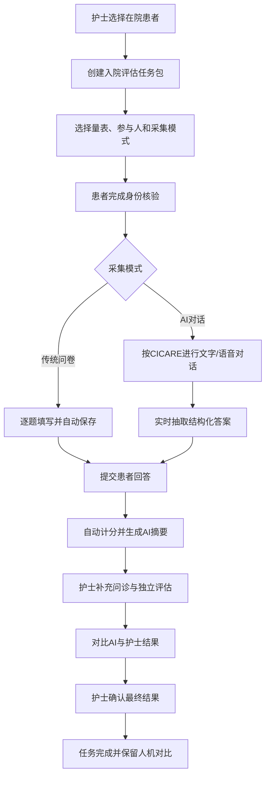

# 前端详细设计需求方案

> 原型目标：在不依赖真实HIS、人脸识别、语音模型和临床生产数据的前提下，完整演示“护士发起任务—患者完成评估—护士实时监控—护士复核确认”的业务闭环.

原型需求:

| 能力 | 原型要求 | 正式系统要求 |
| --- | --- | --- |
| 账号登录 | 使用固定演示账号 | 对接统一身份认证、权限与审计 |
| 人脸识别 | 仅显示入口占位和“暂未开放”提示 | 对接医院认可的身份核验服务 |
| 患者身份核验 | 使用模拟住院号、证件后四位或二维码 | 对接HIS/EMR并校验住院状态 |
| AI对话 | 使用预设脚本模拟流式输出 | 对接真实智能体、模型安全策略与消息系统 |
| 语音识别/播报 | 可用动画、预设录音或浏览器能力模拟 | 对接ASR、TTS，保留音频、文本和播放事件 |
| SSE | 前端模拟或对接测试流 | 后端通过SSE推送；Redis Stream属于后端实现，前端不直接连接 |
| 临床计分 | 使用已确认规则；未确认规则显示“待临床确认” | 规则经护理团队审批后发布 |
| 知情同意签名 | AI输出签名组件, 患者点击签名则进行手写签字 | 按医院制度、法律要求和存证方案实施 |

## 1. 用户角色与权限

### 1.1 原型角色

| 角色 | 使用终端 | 核心目标 | 主要权限 |
| --- | --- | --- | --- |
| 医护端 | 护士站Web、移动平板H5 | 发起任务、监控过程、处理异常、复核结果 | 查看本科室患者；创建/取消任务；监控对话；评价AI；补充和确认结果 |
| 患者端 | 床旁平板、手机 | 独立完成评估、知情同意和宣教 | 仅查看和完成本人的当前住院任务 |

### 1.2 权限与责任边界

- 患者或家属不能创建、取消、转派任务，也不能看到AI内部可信度、护士评价、科研对比和未经确认的临床风险解释。
- 患者端可以看到“系统记录到的回答”，并可在提交前纠正；AI对话中显示的是“待护士确认的信息”，不得包装成诊断结论。
- 护士可以看到患者原始回答、AI结构化答案、AI可信度、量表临床得分、风险标签和异常事件。
- 护士修改AI结果时必须填写修改原因或选择原因标签；修改后不得覆盖AI原始提交。
- 最终确认、退回重评、人工接管、取消任务和查看敏感信息均应预留审计记录。

### 1.3 舒适性交互

- AI对话中明确显示“正在聆听、识别中、思考中、播报中、已暂停、连接中断”等状态。
- 所有回答自动保存，退出、刷新或短暂断网后可以继续。
- 始终显示当前任务、当前量表或阶段、已完成进度和预计剩余内容。
- 每个AI结构化答案应允许护士定位到对应对话证据。

## 2. 系统功能架构

### 2.1 医护端

```text
登录
└─ 护士工作台
   ├─ 今日概览
   ├─ 系统配置(配置|修改系统的已注册评估量表/宣教手册/知情同意书)
   ├─ 患者管理(数据看板)
   │  ├─ 患者列表(住院患者列表+患者详情+创建评估任务)
   │  ├─ 实时监控
   │  │ ├─ 对话回放(选择患者/实时监控患者AI对话/人工接管)
   │  │ └─ 评估任务
   │  │     ├─ 进行中
   │  │     ├─ 待复核
   │  │     ├─ 需人工介入
   │  │     └─ 已完成
   │  └─ AI评估总结
   └─ AI质量评价
      ├─ 人工逐轮反馈
      ├─ AI对话质量
      └─ AI评估质量
```

### 2.2 患者端

```text
身份核验
├─ 首页(住院宣教、住院指南、注意事项等)
├─ 住院AI助手(主要服务住院生活指导, 患者主动点击进入, 可以咨询住院相关问题, 不回答医学专业问题)
└─ 通知页(接收医护端发布的任务)
   └─ 任务列表(点击某任务)
      ├─ 传统问卷
      └─ AI对话评估
            ├─ AI对话量表评估(语音对话/文字交流)
            ├─ 任务进度
            ├─ 实时宣教
            ├─ 知情同意签字
            └─ 住院问答
```

## 3. 核心业务流程

### 3.1 总体闭环



### 3.2 任务创建流程

1. 护士从患者列表选择某次住院记录。
2. 系统展示患者姓名、住院号、科室、病区、床号、入院时间和诊断快照。
3. 护士选择参与人：患者本人、家属或代理人；选择非患者本人时必须填写关系和原因。
4. 护士选择评估场景：入院评估、复评、转科或出院；一期默认入院评估。
5. 护士勾选量表：入院评估单、ADL、NRS2002、Braden、跌倒/坠床风险。
6. 护士选择采集模式：传统问卷或AI对话。该模式属于父级任务，子量表继承。
7. 护士按需选择知情同意文档和宣教内容；系统可根据量表、科室和患者信息展示推荐项。
8. 设置负责护士、计划开始时间和备注。
9. 系统展示任务摘要和预计题量，护士确认后发布。
10. 创建成功后显示任务编号、患者进入方式和“查看监控”入口。

约束：

- 未选择患者、量表、采集模式或负责护士时不可发布。
- 同一住院记录下若存在相同未完成任务，应提醒护士，允许返回查看，避免重复创建。
- 已开始的任务不可直接更改采集模式；需取消原任务并重新创建，保留取消原因。

### 3.3 传统问卷流程

1. 患者进入任务详情，确认当前参与人和预计用时。
2. 页面按量表和分组展示题目，默认一次展示一个分组；患者可查看任务目录。
3. 每次答题后自动保存，并更新“已回答N/共M题”。
4. 条件题根据前序答案动态出现或隐藏；被隐藏题不计入必答总数。
5. 派生字段如BMI由系统计算，只读展示，不计入患者必答题。
6. 患者点击“检查并提交”时，系统定位首个未完成必答题。
7. 所有当前可见必答题完成后，显示提交确认页。
8. 提交后答案进入待护士复核状态；患者不能直接修改，需由护士退回重填。

### 3.4 AI对话流程

AI对话必须可映射到CICARE六个阶段：

| 阶段 | 患者端表现 | 医护端监控重点 |
| --- | --- | --- |
| Connect 接触 | 核对姓名、住院信息、喜欢的称呼、参与人 | 身份是否一致、是否需要家属协助 |
| Introduce 介绍 | 说明AI身份、用途、预计时长、隐私提示 | 话术是否完整、患者是否同意继续 |
| Communicate 沟通 | 按量表顺序口语化提问 | 当前量表、关联题目、采集进度 |
| Ask 询问 | 主动询问不适、担心、问题和需要的帮助，并按异常回答追问 | 风险命中、追问是否合理、是否漏问 |
| Respond 回应 | 使用审核内容回答并触发实时宣教 | 回答依据、宣教适宜性、是否应转人工 |
| Exit 结束 | 复述已采集重点，说明护士将复核和下一步安排 | 是否完成必答项、AI总结是否生成 |

对话要求：

- 患者可以在文字输入和语音输入之间切换，不改变任务采集模式。
- AI每轮回复以SSE逐字或分段呈现；界面需展示生成中、停止生成和重新连接状态。
- 语音模式下展示当前音频状态，禁止AI播报与麦克风收音同时进行以避免回声。
- 患者可说“暂停”“重复一遍”“我不明白”“跳过”“找护士”；强制问题不可无提示跳过。
- 每次形成结构化答案后，患者侧的“已记录信息”区域实时更新，允许患者纠正。
- AI必须完成当前所有可见必答题或明确标记拒答/无法回答，才能结束评估。
- 若患者更正回答，保留原始消息，结构化答案更新为最新有效值并显示“已更正”。

### 3.5 实时追问与宣教

| 触发示例 | 系统追问 | 患者端宣教 | 医护端事件 |
| --- | --- | --- | --- |
| 药物过敏=有 | 药物名称、表现、发生时间、是否就医 | 提醒每次就医主动告知 | 高优先级风险事件 |
| 青霉素过敏=有 | 是否出现呼吸困难、休克等 | 不自行使用相关药物，立即告知医护 | 严重表现时转人工 |
| 吸烟=有 | 支/天、年限、戒烟意愿 | 住院禁烟与戒烟建议 | 记录宣教已触发 |
| 跌倒史=有 | 时间、地点、诱因和损伤 | 呼叫铃、防滑鞋、下床协助 | 推荐防跌倒宣教 |
| 吞咽困难=有 | 呛咳、误吸、进食困难 | 正确体位并及时告知护士 | 可能转人工评估 |

展示原则：

- 宣教内容以独立卡片插入对话，标注“根据您的回答提供”。
- 患者可暂停、重听、确认已了解或选择仍不理解。
- 医护端显示触发规则、来源回答、宣教状态和是否需要跟进。
- 宣教未完成不得伪装为已完成；需要Teach-back时进入独立理解确认步骤。

### 3.6 知情同意宣讲流程

1. 展示文档名称、版本、预计时长、主要参与人和AI身份说明。
2. 按条款逐条展示患者易懂文本并进行语音播报。
3. 每条显示未开始、播报中、已听完、未理解、已确认、拒绝或需人工解释。
4. 普通条款是否允许跳过由配置决定；重要或必须确认条款在原型中禁止直接跳过。
5. 患者可以暂停、继续、重听、查看原文和提出问题。
6. 关键条款完成后，患者选择“已理解并确认”“不理解”“拒绝/暂不决定”。
7. 不理解、拒绝或AI无法回答时，立即转入护士待办。
8. 所有强制条款完成后进入总体决定页；播放完成不得自动勾选同意。
9. 原型可展示手写签名区域，但必须标注“演示占位，不代表有效电子签名”。

### 3.7 护士复核流程

1. 任务完成采集后进入“待护士复核”。
2. AI对话模式下，护士查看患者原始回答、AI结构化结果、分数、风险等级、触发事件和AI总结；纯传统问卷模式只展示患者提交、规则计分和触发事件。
3. AI对话模式下，护士可点击任意答案定位到对应对话消息或音频证据。
4. 护士进行补充问诊，形成护士独立答案，而不是覆盖AI答案或患者原始提交。
5. AI实际参与评估时，系统展示AI与护士结果的逐题差异、总分差异、风险等级差异、漏问和修正数量；纯传统问卷不生成虚假的人机对比。
6. 有差异的字段要求护士选择差异原因并填写必要说明。
7. 护士可以确认最终结果、退回患者重评或作废任务。
8. 最终确认前必须完成所有临床必填项，并处理高风险未完成事件。
9. 最终确认后任务进入已完成，保留AI提交、护士提交、最终提交和复核记录。
