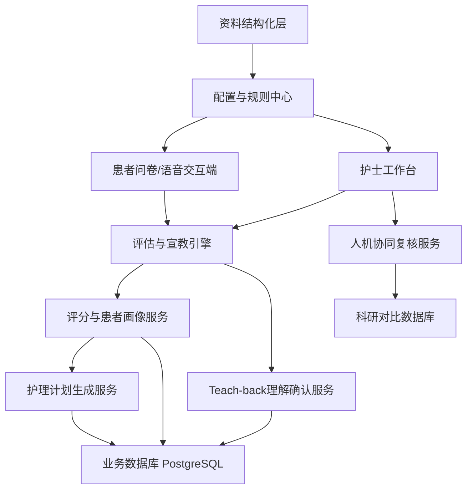
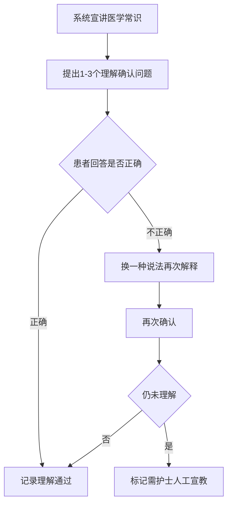
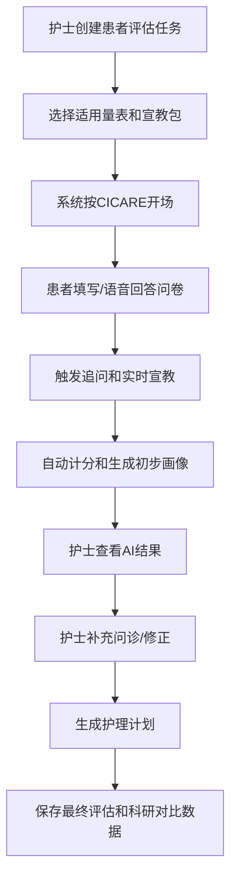
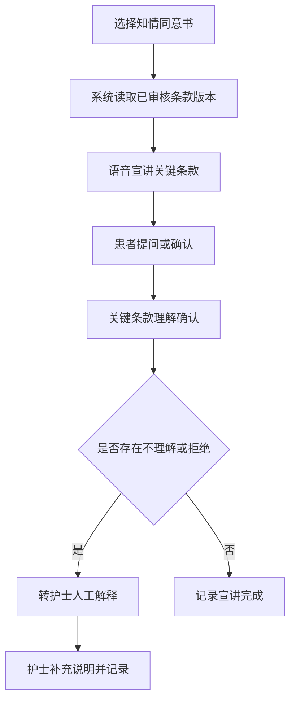
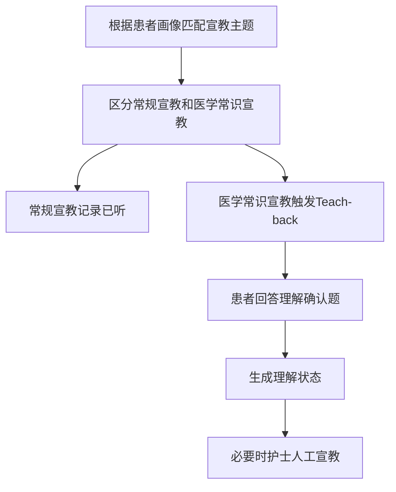

# 医疗评估与宣教系统项目总需求

## 1. 项目定位

本项目面向住院患者入院阶段的护理评估(两种方案: 传统问卷+AI对话)、知情同意宣讲、分级宣教、护理计划生成等功能, 开发一款 harness 智能体平台.

系统分为两个端使用: 
- 医护端.
  - 医护端共有以下几种角色: 主管医生护士、病区主任、护士长、医生办公室、护士站;

- 患者端. 患者端则为患者本人及其家属使用.

### 1.2. 文档资料范围

| 资料类别 | 当前来源 | 系统用途 |
| --- | --- | --- |
| 评估表 | `docs/文档/评估表` | 问卷配置、评分规则、护理风险触发条件 |
| 结构化评估表 | `docs/structured/assessment-scales` | 第一版问卷配置和后续数据库导入来源 |
| 知情同意书 | `docs/文档/知情同意书` | 条款拆解、语音宣讲、关键确认点 |
| 出入院宣教 | `docs/文档/出入院宣教（冠心病患者为例）` | 常规宣教、医学常识宣教、Teach-back题库 |
| 入院介绍内容 | `docs/文档/入院介绍内容.docx` | 入院流程和住院须知类宣教 |

## 3. 资料范围

| 资料类别 | 当前来源 | 系统用途 |
| --- | --- | --- |
| 评估表 | `docs/文档/评估表` | 问卷配置、评分规则、护理风险触发条件 |
| 结构化评估表 | `docs/structured/assessment-scales` | 第一版问卷配置和后续数据库导入来源 |
| 知情同意书 | `docs/文档/知情同意书` | 条款拆解、语音宣讲、关键确认点 |
| 出入院宣教 | `docs/文档/出入院宣教（冠心病患者为例）` | 常规宣教、医学常识宣教、Teach-back题库 |
| 入院介绍内容 | `docs/文档/入院介绍内容.docx` | 入院流程和住院须知类宣教 |

## 4. 用户角色

| 角色 | 主要能力 |
| --- | --- |
| 患者/家属 | 接受AI问询、填写问卷、听取知情同意和宣教、回答Teach-back问题 |
| 护士 | 发起评估、查看AI问询结果、补充问诊、修正评分、确认护理计划 |
| 护理管理者 | 配置量表、宣教材料、规则模板、质控指标 |
| 科研人员 | 查看AI评估与护士评估对比数据，导出脱敏数据用于研究 |
| 系统管理员 | 管理账号、科室、权限、模板版本、审计记录 |

## 5. 总体系统架构

## 6. 核心模块设计

### 6.1 评估表问卷模块

第一版以结构化问卷为主，不直接做复杂自由问诊。每张评估表被抽象为表单、分组、题目、选项、分值、结果解释和触发规则。

需要支持：

| 能力 | 说明 |
| --- | --- |
| 量表列表 | 展示ADL、NRS2002、Braden、跌倒/坠床风险、入院评估单等 |
| 问卷填写 | 用户看问题并勾选选项，支持单选、多选、文本、数字、日期等字段 |
| 自动计分 | 根据结构化配置自动计算总分和分项分 |
| 结果解释 | 对ADL、NRS2002等已有明确规则的量表自动生成解释 |
| 待确认规则标记 | 对Braden、跌倒表等缺少阈值的项目，先展示总分并提示风险等级待规则审批 |
| 历史记录 | 保存每次评估的原始答案、计算结果、表单版本 |

一期可实现量表：

| 量表 | 一期处理方式 |
| --- | --- |
| ADL | 可完整问卷化、自动计分、自动解释 |
| NRS2002 | 可完整问卷化、自动计分、自动解释 |
| Braden | 可问卷化、自动计分，风险等级阈值需补充 |
| 跌倒/坠床风险 | 可问卷化、自动计分，多选计分策略和风险等级阈值需补充 |
| 入院评估单 | 可做信息采集表，引用其他量表结果，不作为单一评分量表 |

### 6.2 CICARE对话规则模块

系统问询流程应遵循CICARE规则，先以固定流程和话术模板实现，后续再加入更细的以患者为中心规则。

| CICARE阶段 | 系统行为 |
| --- | --- |
| Connect | 建立连接，确认患者身份、称呼、语言偏好和当前状态 |
| Introduce | 说明系统身份、问询目的、预计时长、数据用途 |
| Communicate | 按量表逐项询问，使用患者易懂语言解释医学词汇 |
| Ask | 主动询问患者是否有疑问，针对关键回答追问 |
| Respond | 对患者疑问给出标准化回答，超出范围时提示护士介入 |
| Exit | 总结本次评估结果、下一步安排和需护士确认事项 |

关键设计：

| 设计点 | 说明 |
| --- | --- |
| 话术模板 | 每个阶段配置标准话术，避免AI自由发挥过度 |
| 问题改写 | 将纸质量表问题转为口语化表达，但保留原题映射 |
| 中断恢复 | 患者暂停后可从上次问题继续 |
| 安全边界 | 涉及诊断、治疗承诺、用药调整时转交护士或医生 |

### 6.3 追问机制与实时宣教模块

追问机制是本项目的关键差异点。系统不能只记录“是/否”，还要根据答案触发细化问题和实时宣教。

触发规则示例：

| 场景 | 触发追问 | 实时宣教 |
| --- | --- | --- |
| 药物过敏=有 | 追问具体药物、过敏表现、发生时间、是否就医 | 提醒下次就医主动告知医生和护士 |
| 青霉素过敏=有 | 追问皮疹、呼吸困难、休克等严重程度 | 强提醒避免自行使用相关药物 |
| 吸烟=有 | 追问每日支数、年限、是否愿意戒烟 | 给出住院期间禁烟和戒烟建议 |
| 饮酒=有 | 追问频率、每日量、是否停饮不适 | 宣教酒精与疾病、药物相互作用风险 |
| 跌倒史=有 | 追问发生时间、地点、诱因、损伤情况 | 宣教呼叫铃、防滑鞋、下床协助 |
| 吞咽困难=有 | 追问呛咳、进食困难、误吸史 | 宣教进食体位和及时告知护士 |
| ADL低分 | 追问主要依赖环节 | 宣教寻求协助，避免自行下床 |

规则实现建议：

| 层级 | 说明 |
| --- | --- |
| 基础规则 | 基于题目答案触发固定追问和宣教 |
| 组合规则 | 多个风险因素共同出现时触发更高等级提醒 |
| AI改写 | 在不改变医学含义的前提下，将宣教内容转为患者易懂表达 |
| 人工审批 | 所有追问和宣教模板上线前需要护理团队审核 |

### 6.4 知情同意语音对话模块

知情同意书不应整篇朗读，而应拆成关键条款、患者权利、风险提示、费用说明、确认问题和签署记录。

需要设计：

| 能力 | 说明 |
| --- | --- |
| 条款结构化 | 将PDF知情同意书拆成标题、适用场景、关键条款、风险、患者确认点 |
| 语音宣讲 | 使用语音播报或语音对话宣讲关键条款 |
| 重点强调 | 对费用、自费、身份确认、护理安全、检查风险等重点内容加强确认 |
| 患者提问 | 患者可追问，系统基于已审核知识回答 |
| 理解确认 | 通过简短问题确认患者是否理解关键条款 |
| 记录留痕 | 保存宣讲版本、播放/对话时间、确认结果、护士复核状态 |

知情同意书建议分层：

| 类型 | 示例资料 | 处理方式 |
| --- | --- | --- |
| 入院告知类 | 住院医疗告知书（入院须知） | 宣讲住院规则、权利义务、探视陪护等 |
| 护理安全类 | 护理安全知情同意书GDSY | 强调跌倒、压疮、管路、约束等护理安全事项 |
| 费用医保类 | 医保、公医患者住院身份确认书；自费项目知情同意书 | 强调身份确认、自费项目、价格政策 |
| 检查检测类 | 血液传播性疾病检测告知书V2 | 强调检测目的、隐私、结果处理 |
| 专科宣教类 | VTE护理宣教 | 可归入宣教知识库并支持Teach-back |

### 6.5 分级宣教与Teach-back模块

系统需要区分常规宣教和医学常识宣教。不是所有宣教都要Teach-back，否则会增加患者负担。

| 宣教类型 | 示例 | 是否Teach-back |
| --- | --- | --- |
| 常规宣教 | 入院流程、病房环境、呼叫铃、陪护探视、订餐 | 一般不需要，可做确认已听 |
| 护理安全宣教 | 防跌倒、防压疮、管路保护、禁烟 | 对高风险患者需要 |
| 医学常识宣教 | 核磁共振禁忌、用药注意事项、PCI术后注意事项 | 需要 |
| 个体化宣教 | 根据评估结果触发，如吸烟、过敏、吞咽困难 | 需要按风险程度决定 |

Teach-back流程：

Teach-back题目示例：

| 宣教主题 | 反问示例 |
| --- | --- |
| 核磁共振禁忌 | “如果您体内有心脏起搏器或金属植入物，检查前应该告诉谁？” |
| 防跌倒 | “如果夜间想下床，您应该先做什么？” |
| 药物过敏 | “下次就医时，您需要主动告诉医生哪件事？” |
| 冠心病出院用药 | “如果您忘记服药或出现不舒服，应该自行停药还是联系医护人员？” |

### 6.6 患者画像与护理计划生成模块

护理计划生成应基于评估结果，而不是凭空生成。系统先形成患者画像，再给护士推荐护理重点。

患者画像维度：

| 维度 | 数据来源 |
| --- | --- |
| 配合度 | Teach-back结果、问询完成度、依从性评分、护士补充评价 |
| 认知度 | 精神认知、理解确认结果、是否需要反复解释 |
| 自理能力 | ADL评分、入院评估单自理能力字段 |
| 跌倒风险 | 跌倒/坠床风险评估单、既往跌倒史、步态和平衡 |
| 压疮风险 | Braden评分、皮肤状况、卧床情况 |
| 营养风险 | NRS2002评分、BMI、摄食减少、体重变化 |
| 沟通风险 | 语言表达、听力视力、意识状态 |
| 宣教需求 | 吸烟、饮酒、药物过敏、疾病类型、出入院阶段 |

护理计划输出：

| 输出内容 | 说明 |
| --- | --- |
| 风险摘要 | 用简短文字说明主要风险 |
| 护理重点 | 从护理措施库中匹配推荐项 |
| 宣教重点 | 推荐需要宣教或Teach-back的主题 |
| 护士复核项 | 标记需要护士确认的异常或高风险回答 |
| 交接班提示 | 生成适合护理交接班查看的重点 |

### 6.7 人机协同与科研对比模块

系统应保留AI评估和护士评估的差异，不能只保存最终结果。这样才能支持后续科研和效果验证。

需要支持：

| 能力 | 说明 |
| --- | --- |
| AI问询记录 | 保存AI提出的问题、患者回答、追问、宣教、Teach-back结果 |
| 护士补充问诊 | 护士可在AI问询后继续补问，并记录结构化结果 |
| 护士修正 | 护士可修改AI评分、风险等级、护理计划建议 |
| 差异记录 | 系统记录AI结果与护士结果的差异字段、差异原因 |
| 质控标记 | 标记AI不确定、患者不理解、高风险需人工确认等情况 |
| 科研导出 | 支持按项目导出脱敏数据，用于准确率、耗时、患者理解度等分析 |

对比评估指标：

| 指标 | 说明 |
| --- | --- |
| 一致率 | AI评分/风险判断与护士最终判断的一致比例 |
| 修正率 | 护士对AI结果进行修改的比例 |
| 漏问率 | 护士补充发现AI未覆盖问题的比例 |
| 宣教理解率 | Teach-back一次通过率、二次通过率、需人工宣教率 |
| 完成耗时 | AI问询、护士复核、总流程耗时 |
| 患者体验 | 可通过满意度或是否中断问询衡量 |

## 7. 核心业务流程

### 7.1 入院评估流程

### 7.2 知情同意宣讲流程

### 7.3 宣教与Teach-back流程

## 8. 数据模型设计

### 8.1 配置类数据

| 表/集合 | 作用 |
| --- | --- |
| `form_templates` | 表单模板，如ADL、NRS2002、入院评估单 |
| `form_versions` | 表单版本，支持审批后发布和历史追溯 |
| `form_sections` | 表单分组 |
| `form_questions` | 问题定义 |
| `form_options` | 选项、分值、排序、是否触发追问 |
| `scoring_rules` | 总分公式、分项规则、等级解释 |
| `education_materials` | 宣教材料 |
| `consent_templates` | 知情同意书结构化模板 |
| `dialogue_scripts` | CICARE话术、宣讲话术、追问话术 |
| `trigger_rules` | 追问、宣教、转人工、护理计划触发规则 |

### 8.2 业务类数据

| 表/集合 | 作用 |
| --- | --- |
| `patients` | 患者基础信息，可与院内系统对接 |
| `encounters` | 一次住院或一次评估上下文 |
| `assessment_sessions` | 一次评估任务 |
| `assessment_answers` | 患者每题回答 |
| `assessment_scores` | 分项分、总分、等级 |
| `dialogue_turns` | AI与患者每轮对话记录 |
| `education_sessions` | 宣教记录 |
| `teachback_results` | Teach-back问题、回答、结果 |
| `consent_sessions` | 知情同意宣讲记录 |
| `patient_profiles` | 患者画像 |
| `nursing_plans` | 护理计划建议和护士确认结果 |
| `nurse_reviews` | 护士复核、补充问诊、修正记录 |
| `ai_nurse_comparisons` | AI结果与护士结果对比 |

### 8.3 审计与科研类数据

| 表/集合 | 作用 |
| --- | --- |
| `template_approvals` | 模板审批记录 |
| `clinical_audit_logs` | 临床操作审计 |
| `data_exports` | 科研数据导出记录 |
| `deidentified_records` | 脱敏科研数据视图或导出快照 |
| `model_quality_metrics` | AI问询质量、修正率、一致率等指标 |

## 9. AI能力设计

AI在系统中应定位为“受控的护理问询和宣教助手”，关键医学规则来自已审核配置，不依赖模型自由生成。

| AI能力 | 设计边界 |
| --- | --- |
| 问题口语化 | 可以将量表题目改写得更易懂，但必须绑定原始题目ID |
| 智能追问 | 基于规则触发，追问内容来自审核模板 |
| 实时宣教 | 基于患者回答触发，宣教内容来自知识库 |
| Teach-back判断 | 可辅助判断患者回答是否理解，但需保留原始回答和判断依据 |
| 护理计划草案 | 根据评分和规则生成建议，由护士最终确认 |
| 异常识别 | 识别高风险、不理解、拒绝回答、情绪异常等并转人工 |

不建议AI直接做：

| 不建议事项 | 原因 |
| --- | --- |
| 独立诊断 | 涉及医疗责任，应由医生判断 |
| 修改医嘱 | 超出护理评估系统边界 |
| 自行发明宣教内容 | 医疗内容需审核 |
| 隐式改变评分规则 | 评分必须可追溯、可解释 |

## 10. 安全、合规与质控设计

| 方向 | 设计要求 |
| --- | --- |
| 模板审批 | 表单、宣教、知情同意、追问规则上线前必须审批 |
| 版本追溯 | 每次评估记录使用的模板版本必须保存 |
| 最终责任 | 护士确认后的结果作为临床最终记录 |
| 隐私保护 | 患者身份信息、语音文本、科研导出需权限控制和脱敏 |
| 审计日志 | 记录谁创建、修改、确认、导出数据 |
| 转人工机制 | 高风险、不理解、拒绝、异常表达必须转护士 |
| 内容边界 | AI不得承诺治疗效果，不得替代医生诊疗建议 |

## 11. 一期MVP范围

一期目标是快速验证“问卷化评估 + 自动计分 + 护士复核 + 数据留痕”是否可用。

建议一期包含：

| 模块 | 范围 |
| --- | --- |
| 量表问卷 | ADL、NRS2002、Braden、跌倒/坠床风险、入院评估单 |
| 患者基础信息 | 手动录入或模拟患者信息 |
| 自动计分 | 已有规则的量表自动计分和解释，缺失规则标记待确认 |
| 追问宣教 | 先实现药物过敏、吸烟、跌倒史、吞咽困难等高价值场景 |
| 护士工作台 | 查看AI结果、补充问诊、修正结果、确认护理计划 |
| 数据库 | PostgreSQL保存模板、答案、评分、复核记录 |
| 审批文档 | 结构化表单和规则先经Markdown审批后导入 |

一期暂缓：

| 模块 | 暂缓原因 |
| --- | --- |
| 完整语音对话 | 先用文本问卷验证流程，语音可作为二期增强 |
| 全量知情同意书语音化 | 需要先完成条款拆解和临床审批 |
| 复杂患者画像模型 | 一期先用规则画像，后续根据真实数据优化 |
| HIS/EMR对接 | 一期可独立运行，减少集成不确定性 |
| 大规模科研导出 | 先保留数据结构，后续完善脱敏和统计 |

## 12. 二期与后续扩展

| 阶段 | 目标 |
| --- | --- |
| 二期 | 加入语音问询、知情同意语音宣讲、Teach-back题库、更多宣教材料 |
| 三期 | 与院内系统对接，自动拉取患者信息、回写护理记录 |
| 四期 | 基于真实人机对比数据优化AI问询策略和护理计划推荐 |
| 五期 | 建立多科室模板库，支持科室差异化配置和科研分析平台 |

## 13. 当前关键待确认问题

| 问题 | 影响 |
| --- | --- |
| Braden风险等级阈值 | 影响自动风险等级判断和护理计划触发 |
| 跌倒/坠床风险等级阈值 | 影响高危患者识别和防跌倒护理计划 |
| 跌倒表多选计分策略 | 影响总分准确性 |
| 入院评估单字段完整性 | 该表来自扫描件视觉转录，需要人工复核 |
| 知情同意书关键条款拆分标准 | 影响语音宣讲和理解确认设计 |
| Teach-back适用范围 | 影响患者负担和护士工作量 |
| AI结果是否可直接进入护理记录 | 影响责任边界和系统审批流程 |

## 14. 建议下一步

1. 审批 `docs/structured/assessment-scales/assessment-scales-review.md` 中的量表结构和待确认点。
2. 明确一期优先量表的风险等级阈值和多选计分规则。
3. 将审批后的量表JSON导入PostgreSQL，形成第一版表单配置库。
4. 设计并实现问卷填写端、护士复核端和评估结果保存接口。
5. 选择1-2份知情同意书做条款拆解试点。
6. 选择冠心病入院/出院宣教中的高频医学常识，建设第一批Teach-back题库。
